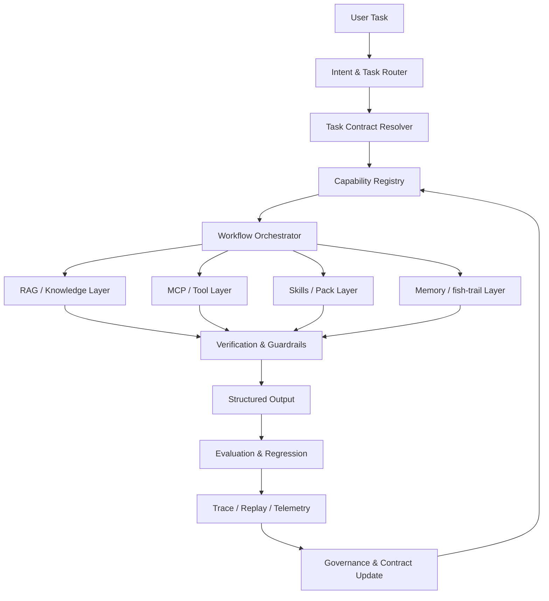

# 约束化 AI Agent 一致性：基于 Harness Engineering 的研究方案

## 0. 方案定位

本研究方案围绕一个核心判断展开：随着提示词工程逐步发展为上下文工程、能力编排工程与 harness engineering，AI Agent 的行为不应继续主要依赖“模型自己聪明、自己理解、自己规划、自己遵守格式”，而应逐步转向由外部工程系统显式约束、显式编排、显式验证。

本研究并不试图证明“模型能力不重要”。更严谨的命题应表述为：

> 在高可规约、高可验证、高工具化的任务空间中，通过 contracts、registry、workflow、RAG、tools、MCP、skills、memory policy、guardrails、telemetry 与 evaluation discipline，可以显著降低 AI Agent 输出对底层模型能力差异的敏感性，并提高跨模型一致性、可审计性、可复现性与工程可替换性。

这也是“行为约束优先”思想在 AI Agent 工程中的自然延伸。与其试图直接控制模型的内部思想，不如通过制度化流程、外置能力、受控工具、验证器和评估体系约束它在任务中的行为轨迹与最终产物。

本方案建议将该方向命名为：

**Contract-Driven Agent Harness Engineering，简称 CDAHE。**

中文可称为：

**契约驱动的 AI Agent 行为约束工程。**

---

## 1. 研究背景与问题提出

### 1.1 从提示词工程到 harness engineering

早期 prompt engineering 的核心是写好一段提示词，使模型在单轮或少轮对话中产生更可靠的输出。其缺点非常明显：提示词难以复用、难以测试、难以版本化、难以证明正确性，也难以跨模型迁移。

随着 LLM 应用进入 agent 阶段，单一提示词已经不足以支撑复杂任务。一个可用的 agent 系统至少包含以下要素：

- 任务分类与路由；
- 结构化提示词与上下文装配；
- RAG 与知识源管理；
- 工具调用与 MCP 服务；
- skills / capability packs；
- 长短期记忆；
- 状态机与工作流；
- 输入输出 schema；
- guardrails 与 policy gates；
- trace、日志、成本与回放；
- 自动评估与回归测试。

这意味着 AI Agent 的核心工程问题，已经不再是“如何写一条更好的 prompt”，而是“如何构造一个可控、可复现、可演化、可测试的 agent harness”。

### 1.2 人类组织中的类比：SOP、培训与员工手册

用户提出的人类社会观察非常关键：在成熟组织中，同一工种的劳动成果并不会完全取决于个人智商或教育程度。组织之所以能够保证输出一致性，主要依赖：

- 统一的岗位定义；
- 标准作业流程；
- 员工手册；
- 培训体系；
- 工具与设备标准化；
- 检查表；
- 质量验收机制；
- 审批流程；
- 绩效与异常复盘。

这与 AI Agent 的工程约束高度同构：

| 人类组织机制 | AI Agent 对应机制 |
|---|---|
| 岗位说明书 | Agent role / capability profile |
| 员工手册 | System rules / AGENTS.md / policy pack |
| SOP | Workflow / state machine / skill procedure |
| 培训材料 | Few-shot examples / skill documentation / eval cases |
| 工具授权 | Tool permission / MCP capability scope |
| 质检流程 | Validator / test / evaluator |
| 复盘机制 | Reflection / trace review / regression update |
| 组织记忆 | History memory / knowledge base / fish-trail |
| 绩效指标 | success rate / variance / cost / safety metrics |

因此，本研究的关键不是把 AI Agent 拟人化，而是把 AI Agent 制度化：

> 不追求每一个 agent 都像最聪明的人，而追求 agent 系统在足够多任务上像最稳定的流程。

### 1.3 petfish.ai 的现实基础

根据前序研究，kylecui/petfish.ai 已经不是一个普通 prompt 仓库，而是一个 harness engineering 实验田。它已经具备以下基础：

- core / optional packs 的能力分层；
- skills 与 skill pack 的模块化组织；
- project initializer、research skill pack、series-style-governor、reflection 等任务型能力包；
- MCP server，例如 skill-registry、context-state、usage-cost；
- opencode 插件体系，包括 context injection、topic filter、compaction 等；
- installer、remote installer、market-first distribution、skill-publish；
- CI、manifest 校验、smoke test、trigger eval；
- fish-trail 作为 history / topic / compaction 方向的探索；
- 关于 installer hardcoded arrays、dynamic skill discovery、compaction phase limitation、multi-model benchmark 等 issue 中已经暴露出的真实工程问题。

这些实践说明 petfish.ai 已经具备从“技能仓库”升级为“AI Agent 约束运行时与能力治理平台”的基础。

---

## 2. 核心研究命题

### 2.1 原始命题

原始想法可以概括为：

> 通过标准化、模块化的提示词，以及 RAG、tool、MCP、skills、history memory 等机制，可以严格约束 AI Agent 的行为，使其在任务中实现相对统一的行为与输出，并降低模型能力差异带来的影响。

### 2.2 批判性修正

这个命题方向正确，但需要避免过度表述。更稳健的版本是：

> Harness engineering 无法消除模型能力差异，但可以在明确边界内，把任务中的不确定性从模型内部隐式推理迁移到系统外部显式结构，从而在可规约、可验证、可工具化的任务中显著压缩跨模型输出差异。

这里有三个关键边界：

1. **可规约性边界**：任务能否被拆成明确步骤、输入、输出和中间状态。
2. **可验证性边界**：任务结果能否通过 schema、测试、工具执行、人审或事实来源验证。
3. **可工具化边界**：任务所需能力能否被外置为 RAG、tool、MCP、skill 或 workflow。

### 2.3 研究总假设

本研究提出四个假设：

**H1：约束外置假设**  
在可规约任务中，将知识、工具、流程、记忆和验证机制外置，可以显著提升 agent 输出一致性。

**H2：跨模型收敛假设**  
当 agent harness 的 contracts、registry、workflow、memory policy 和 validators 越完整，不同模型之间的任务成功率差距和行为轨迹方差越小。

**H3：任务边界假设**  
该方法在结构化抽取、代码修改、研究流程、项目初始化、文档生成、部署运维等任务上效果更显著；在开放式战略判断、审美创作、复杂谈判和强语义推理任务上效果有限。

**H4：制度化生产假设**  
AI Agent 的可靠生产能力，不应主要来自单个模型的能力，而应来自一套可审计、可回放、可评估、可演化的制度化 harness。

---

## 3. 研究目标

### 3.1 总目标

构建一套面向 AI Agent 的契约驱动 harness engineering 方法论与原型系统，证明在特定任务空间内，系统约束能够显著提升 agent 行为一致性、输出稳定性、跨模型可迁移性和工程可治理性。

### 3.2 具体目标

1. 建立 agent 行为约束的概念模型与形式化描述框架。
2. 将 prompt、RAG、tool、MCP、skills、memory、workflow、guardrails 统一纳入 contract-driven harness 模型。
3. 在 petfish.ai 上实现一个可运行的 harness 原型。
4. 设计跨模型、跨任务、可重复运行的评测体系。
5. 验证不同 harness 组件对一致性、成功率、成本、安全性的影响。
6. 总结可发表的工程范式、实验结论和系统设计原则。
7. 形成 petfish.ai 后续产品化、论文发表和开源社区建设路线。

---

## 4. 研究范围与非目标

### 4.1 研究范围

本研究覆盖以下对象：

- AI coding agent；
- research agent；
- project initialization agent；
- document / course / style governance agent；
- repo maintenance agent；
- skill authoring / skill installer agent；
- memory-aware agent；
- tool-using / MCP-using agent。

重点任务类型包括：

- 项目初始化；
- skill 自动发现与安装；
- 文档风格统一；
- research workflow；
- 代码仓库分析；
- 结构化文档生成；
- 安装器与配置修复；
- 多模型评测；
- memory / compaction / topic filter 实验。

### 4.2 非目标

本研究不追求：

- 证明所有任务都能摆脱模型能力差异；
- 替代 foundation model 本身能力提升；
- 构建完全自治、不需人审的通用 agent；
- 用一个超长 prompt 解决所有问题；
- 在初期实现严格形式化证明级别的 correctness。

本研究追求的是工程上的可控性、可度量性、可复现性和可演化性。

---

## 5. 理论框架

### 5.1 Agent 行为的五层分解

一个 agent 的行为可以分解为五层：

1. **意图层**：用户到底要什么。
2. **任务层**：意图如何被拆成可执行任务。
3. **能力层**：任务需要哪些外部能力。
4. **轨迹层**：agent 实际执行了哪些步骤、调用了哪些工具、读取了哪些记忆。
5. **产物层**：最终输出是否符合规范、事实、质量与安全要求。

传统 prompt engineering 主要作用于意图层和产物层。Harness engineering 的价值在于同时控制任务层、能力层和轨迹层。

### 5.2 四类不确定性

Agent 不稳定通常来自四类不确定性：

| 不确定性类型 | 表现 | 约束方式 |
|---|---|---|
| 语义不确定性 | 模型误解用户意图 | intent schema、澄清策略、任务分类器 |
| 流程不确定性 | 步骤顺序不稳定 | workflow、state machine、skill procedure |
| 能力不确定性 | 不知道该用什么工具 | registry、capability contract、tool policy |
| 输出不确定性 | 格式、事实、质量波动 | schema、validator、RAG grounding、tests |

本研究的核心就是将这些不确定性逐步显式化、契约化和可验证化。

### 5.3 Contract-Driven Harness 模型

本研究建议将 agent harness 分为六类 contract。

#### 5.3.1 Task Contract

定义任务类型、输入、输出、成功条件、失败条件、允许的自主程度。

示例字段：

```yaml
task_contract:
  task_type: research_plan_generation
  allowed_autonomy: bounded
  requires_sources: true
  requires_structured_output: true
  human_review_required: true
  success_criteria:
    - contains_research_questions
    - contains_experiment_design
    - contains_engineering_roadmap
    - contains_risk_analysis
```

#### 5.3.2 Capability Contract

定义某个 skill、tool、MCP server 或 pack 能做什么、不能做什么、需要什么权限。

示例字段：

```yaml
capability_contract:
  name: research-skill-pack
  version: 1.0.0
  capability_type: skill_pack
  inputs:
    - research_topic
    - target_audience
  outputs:
    - source_index
    - excerpt_notes
    - evidence_ledger
    - final_report
  permissions:
    - web_search
    - local_file_read
  safety_level: medium
  eval_cases:
    - research_trigger_eval.yaml
```

#### 5.3.3 Workflow Contract

定义执行过程、状态转移、终止条件和人审节点。

示例：

```yaml
workflow_contract:
  states:
    - classify_task
    - select_capabilities
    - retrieve_context
    - draft_plan
    - validate_output
    - revise_or_finish
  transitions:
    - from: classify_task
      to: select_capabilities
      condition: task_type_identified
    - from: validate_output
      to: revise_or_finish
      condition: validation_failed
  stop_conditions:
    - validation_passed
    - max_iterations_reached
```

#### 5.3.4 Memory Contract

定义什么信息可以写入记忆、如何召回、何时过期、如何避免污染。

示例：

```yaml
memory_contract:
  scopes:
    - session
    - project
    - global_user_preference
  write_policy:
    require_reason: true
    require_user_stable_preference: true
    prohibit_sensitive_unverified_facts: true
  recall_policy:
    topic_filter_required: true
    max_items: 10
    conflict_resolution: prefer_recent_confirmed
  ttl:
    transient_task_state: 7d
    project_decision: 180d
```

#### 5.3.5 Output Contract

定义最终产物结构、质量门槛、引用要求和格式规范。

```yaml
output_contract:
  format: markdown_report
  required_sections:
    - background
    - research_questions
    - methodology
    - experiments
    - roadmap
    - risks
  validation:
    - schema_check
    - citation_check
    - completeness_check
    - style_check
```

#### 5.3.6 Verification Contract

定义如何评估本次 agent 执行是否成功。

```yaml
verification_contract:
  metrics:
    - task_success
    - schema_validity
    - tool_call_correctness
    - citation_grounding
    - trajectory_conformance
    - cost
    - latency
    - repeatability
  regression_required: true
```

---

## 6. 总体技术架构

### 6.1 总体分层

本研究建议将 petfish.ai 演进为以下架构：



### 6.2 核心组件

#### 6.2.1 Intent & Task Router

负责识别用户任务类型。它不只是做分类，而是决定：

- 是否需要 RAG；
- 是否需要工具；
- 是否需要调用 skill；
- 是否需要读取 history memory；
- 是否需要人审；
- 应使用 workflow 还是 bounded agent loop。

#### 6.2.2 Contract Resolver

负责把任务映射为明确 contract 集合：

- task contract；
- capability contract；
- workflow contract；
- memory contract；
- output contract；
- verification contract。

它是整个系统从“自由对话”进入“制度化执行”的关键入口。

#### 6.2.3 Capability Registry

这是 petfish.ai 最应该优先强化的部分。

现有 skill-registry 已经具备雏形，但需要升级为统一事实源：

- pack manifest；
- skill manifest；
- MCP manifest；
- tool manifest；
- installer source manifest；
- market index；
- dependency graph；
- compatibility matrix；
- security tags；
- eval coverage。

目标是让 installer、market、docs、AGENTS 注入、skill discovery、CI 检查全部从同一 registry 编译生成，避免 hardcoded arrays 与 contract drift。

#### 6.2.4 Workflow Orchestrator

负责把任务执行从自然语言自发规划变成受控状态机。

支持两种模式：

1. **Deterministic Workflow**：适合项目初始化、安装、文档生成、结构化抽取等可规约任务。
2. **Bounded Agent Loop**：适合 research、代码修改、故障排查等需要一定自主性的任务。

Bounded agent loop 必须具备：

- 最大迭代次数；
- 工具调用白名单；
- memory read/write 限制；
- validator gate；
- human checkpoint；
- trace replay。

#### 6.2.5 Memory / fish-trail Layer

fish-trail 不应只做 compaction，而应升级为 memory governance layer。

建议分为：

- Working Memory：本轮任务状态；
- Session Memory：当前对话主题；
- Project Memory：项目长期决策；
- User Preference Memory：稳定偏好；
- Evidence Memory：研究证据与出处；
- Reflection Memory：复盘与失败模式。

每次写入必须记录：

- 写入内容；
- 写入理由；
- 来源；
- 所属 topic；
- TTL；
- 置信度；
- 是否需要用户确认。

#### 6.2.6 Verification & Guardrails

包括：

- schema validation；
- citation validation；
- tool result validation；
- policy validation；
- trajectory validation；
- cost validation；
- security validation；
- regression validation。

其中 trajectory validation 是本研究的重要创新点：不仅检查最终答案，还检查 agent 过程是否符合规定。

#### 6.2.7 Trace / Replay / Telemetry

所有 agent 执行必须可回放。

记录内容包括：

- 输入任务；
- contract snapshot；
- registry snapshot；
- selected skills；
- selected tools；
- retrieval results；
- memory read/write；
- model calls；
- tool calls；
- validator results；
- final artifact；
- cost；
- latency；
- failure reason。

没有 trace，就无法证明 harness 是否真的降低了模型差异。

---

## 7. 研究内容与工作包

### WP1：概念模型与术语体系

目标：建立统一术语，避免“prompt、skill、tool、workflow、memory、agent”混用。

主要任务：

1. 定义 agent harness；
2. 定义 capability、contract、workflow、memory policy；
3. 定义行为一致性、输出一致性、轨迹一致性；
4. 定义跨模型弱耦合；
5. 定义制度化 agent production。

交付物：

- 《Contract-Driven Agent Harness Engineering 概念白皮书》；
- 术语表；
- 架构图；
- 与现有框架的对比表。

### WP2：petfish.ai 现状审计与 contract drift 分析

目标：系统审计 petfish.ai 中已有 harness 组件，识别漂移、重复、硬编码和不一致。

重点检查：

- pack manifest 是否统一；
- installer 是否仍维护 hardcoded arrays；
- skill-registry 是否能识别 core / optional 分层；
- project-initializer 是否仍依赖静态 profile mapping；
- AGENTS.md 注入是否可从 registry 生成；
- market index 与 repo manifest 是否一致；
- CI 是否覆盖 registry、installer、docs 与 market 的一致性；
- fish-trail compaction 是否作用在正确 hook 层。

交付物：

- petfish.ai harness audit report；
- contract drift list；
- priority fix list；
- regression test plan。

### WP3：统一 Capability Registry 设计

目标：把 pack、skill、tool、MCP、memory policy 和 workflow 都注册到统一 capability registry。

主要任务：

1. 设计统一 manifest schema；
2. 设计 pack / skill / MCP / tool / workflow / memory policy 的子 schema；
3. 设计 registry compiler；
4. 生成 installer index、market index、docs index、AGENTS injection block；
5. 实现 dependency graph 与 compatibility matrix。

建议 schema：

```yaml
capability:
  id: petfish.research.source-index
  type: skill
  version: 1.0.0
  pack: research-skill-pack
  description: Build and maintain a research source index.
  inputs:
    - topic
    - source_constraints
  outputs:
    - source_index_file
  permissions:
    - web_search
    - file_write
  dependencies:
    - petfish.research.evidence-ledger
  compatible_hosts:
    - opencode
    - claude-code
  evals:
    - evals/research/source-index.yaml
  security:
    risk_level: low
    data_access: public_web
```

交付物：

- registry schema；
- registry compiler；
- migration plan；
- CI validation tests。

### WP4：Workflow Contract 与状态机原型

目标：将关键任务从自由 agent loop 改造为状态机或 bounded loop。

优先选择三个任务：

1. project initialization；
2. research workflow；
3. skill authoring / skill publishing。

每个任务都定义：

- input schema；
- workflow state；
- allowed tools；
- memory access scope；
- validation gates；
- final artifact schema；
- failure recovery path。

交付物：

- workflow contract DSL；
- 三个任务的 workflow spec；
- runtime prototype；
- trace replay demo。

### WP5：Memory Contract 与 fish-trail 升级

目标：把 fish-trail 从 compaction plugin 升级为受控 memory layer。

主要任务：

1. 区分 topic memory、project memory、reflection memory、evidence memory；
2. 定义 write policy；
3. 定义 recall policy；
4. 记录 memory decision trace；
5. 对比 Phase 2 compaction 与 Phase 3 message transform；
6. 评估 memory 对成本、一致性和污染率的影响。

关键实验：

- 无 memory；
- naive memory；
- topic-filtered memory；
- contract-governed memory；
- full fish-trail memory。

交付物：

- memory contract schema；
- fish-trail vNext design；
- memory benchmark；
- memory pollution analysis。

### WP6：Verification 与 Guardrails

目标：不仅验证最终输出，还验证执行轨迹。

验证对象：

- input 是否满足 task contract；
- skill 是否按 registry 选择；
- tool 是否在白名单内；
- memory 是否按 policy 读取；
- output 是否符合 schema；
- citations 是否可追溯；
- cost 是否超限；
- trajectory 是否偏离 workflow；
- 是否需要人审。

核心指标：

- schema validity；
- citation grounding rate；
- tool-call correctness；
- workflow conformance；
- memory policy compliance；
- human acceptance rate；
- policy violation rate。

交付物：

- verification contract；
- validators；
- quality gate CLI；
- CI integration。

### WP7：跨模型一致性评测

目标：验证 harness 是否真的降低模型差异。

模型分层：

- 强模型：如 Claude / GPT / Gemini 高阶模型；
- 中模型：如 GLM、Qwen、DeepSeek、Kimi 等主力模型；
- 轻量模型：mini / flash / local quantized model。

任务分层：

| 任务类别 | 可规约性 | 可验证性 | 预期效果 |
|---|---:|---:|---|
| JSON / 信息抽取 | 高 | 高 | harness 收益极大 |
| 项目初始化 | 高 | 中高 | 收益明显 |
| skill 安装 / 发布 | 高 | 高 | 收益明显 |
| 代码修复 | 中高 | 高 | 收益明显，但依赖模型调试能力 |
| research workflow | 中 | 中 | 收益明显但不完全收敛 |
| 风格治理 | 中 | 中 | 收益中等 |
| 开放战略判断 | 低 | 低 | 收益有限 |

实验臂：

1. Prompt baseline；
2. Prompt + schema；
3. Prompt + RAG；
4. Prompt + tool；
5. Prompt + skill registry；
6. Workflow + validator；
7. Full harness。

主要指标：

- task success rate；
- output consistency；
- trajectory consistency；
- cross-model performance gap；
- repeated-run variance；
- tool-call sequence edit distance；
- memory read/write consistency；
- cost；
- latency；
- human review burden。

交付物：

- benchmark dataset；
- evaluation harness；
- 多模型实验报告；
- ablation study；
- 可发表实验结果。

---

## 8. 实验设计

### 8.1 实验问题

本研究至少回答以下问题：

1. Harness 组件是否能提升任务成功率？
2. Harness 组件是否能降低同一模型多次运行的输出方差？
3. Harness 组件是否能降低不同模型之间的输出差距？
4. 哪些组件贡献最大：schema、RAG、tool、workflow、memory、validator，还是 registry？
5. 哪些任务适合制度化 agent production？
6. 哪些任务仍然强依赖底层模型？
7. Memory 是提高一致性，还是引入长期污染？
8. Tool / MCP 是提升能力，还是引入安全风险？
9. Workflow 是提高稳定性，还是降低开放问题解决能力？
10. petfish.ai 的 pack / skill / installer / registry 架构是否能成为通用 harness 原型？

### 8.2 实验任务集

建议构造六类任务集。

#### T1：结构化抽取任务

输入：混乱文本、配置文件、文档片段。  
输出：固定 JSON schema。  
验证：schema validity、字段准确率、重复运行一致性。

用途：验证 output contract 与 schema 的价值。

#### T2：项目初始化任务

输入：用户描述一个项目目标。  
输出：目录结构、AGENTS.md、README、skills selection、MCP 建议。  
验证：是否选择正确 profile、是否安装正确 pack、是否生成必要文件。

用途：验证 dynamic skill discovery 与 workflow contract。

#### T3：Skill Authoring 任务

输入：用户想设计一个 skill。  
输出：SKILL.md、manifest、eval、example、quality gate。  
验证：manifest 合法性、eval 非空、handoff boundary、可安装性。

用途：验证 petfish skill factory 思路。

#### T4：Research Workflow 任务

输入：一个研究主题。  
输出：source index、excerpt notes、evidence ledger、final report。  
验证：来源覆盖、引用一致性、结构完整性、人工评分。

用途：验证 research-skill-pack 与 evidence-ledger 的价值。

#### T5：Memory / fish-trail 任务

输入：多轮、多主题、跨会话任务。  
输出：正确召回相关历史，忽略无关历史。  
验证：recall precision、recall completeness、pollution rate、token cost。

用途：验证 memory contract。

#### T6：Repo Maintenance 任务

输入：一个 repo issue，例如 installer 路径错误、registry schema 漂移。  
输出：修复方案、补丁、测试。  
验证：测试是否通过、是否引入 regression。

用途：验证 coding agent 在 harness 下的工程可用性。

### 8.3 实验变量

自变量：

- 是否使用 schema；
- 是否使用 RAG；
- 是否使用 tool / MCP；
- 是否使用 skill registry；
- 是否使用 workflow；
- 是否使用 memory；
- 是否使用 validator；
- 是否使用 full harness；
- 不同模型类型。

因变量：

- 成功率；
- 一致性；
- 方差；
- 成本；
- 安全违规率；
- 人审负担；
- 回归失败率。

控制变量：

- 相同输入；
- 相同 corpus snapshot；
- 相同 registry snapshot；
- 相同 tool mock；
- 相同 temperature；
- 相同 maximum iterations；
- 相同评估器。

### 8.4 统计方法

建议：

- 每个任务每个模型每个实验臂至少运行 5 次；
- 使用均值、中位数、标准差、置信区间；
- 使用 paired comparison；
- 使用 bootstrap confidence interval；
- 报告 failure mode breakdown；
- 不只报告平均分，还报告 variance reduction。

关键指标：

```text
CrossModelGap = max(success_rate_by_model) - min(success_rate_by_model)

VarianceReduction = 1 - variance(full_harness) / variance(prompt_baseline)

TrajectoryConsistency = average_similarity(tool_sequence, workflow_state_sequence, memory_events)

ContractCompliance = passed_contract_checks / total_contract_checks
```

---

## 9. petfish.ai 落地路线

### 9.1 第一阶段：收敛单一事实源

优先解决：

- installer hardcoded arrays；
- profile 到 pack 的静态映射；
- registry 不识别 core / optional 分层；
- manifest、docs、market、installer 不一致；
- CI 未覆盖所有 contract drift。

行动：

1. 定义统一 pack-manifest schema；
2. 编写 registry compiler；
3. installer 从 registry 读取，而不是写死 pack 列表；
4. market index 从 registry 生成；
5. docs capability list 从 registry 生成；
6. AGENTS injection block 从 registry 生成；
7. CI 增加 contract drift check。

阶段交付：

- petfish registry v2；
- installer refactor；
- docs / market / AGENTS auto-generation；
- drift check CI。

### 9.2 第二阶段：动态 skill discovery

目标：让 project-initializer 不再依赖固定 profile mapping。

机制：

1. 用户意图解析；
2. profile-first capability query；
3. intent-backup skill search；
4. dependency resolution；
5. risk / permission check；
6. install plan generation；
7. user review；
8. execution。

阶段交付：

- dynamic skill discovery engine；
- explainable install plan；
- skill selection trace；
- benchmark: static vs dynamic。

### 9.3 第三阶段：fish-trail vNext

目标：从 compaction plugin 升级为受控 memory layer。

关键改造：

- message assembly hook；
- topic graph；
- memory write policy；
- memory recall policy；
- token budget allocator；
- memory trace；
- memory pollution detector。

阶段交付：

- fish-trail vNext design；
- prototype；
- memory benchmark；
- Phase 2 vs Phase 3 对比报告。

### 9.4 第四阶段：workflow contract runtime

目标：将重点 skill pack 变成可执行 workflow。

优先 workflow：

- project initialization；
- research workflow；
- skill authoring；
- series style governance；
- reflection workflow。

阶段交付：

- workflow DSL；
- workflow runner；
- trace viewer；
- validator integration。

### 9.5 第五阶段：多模型评测平台

目标：证明 harness 的跨模型一致性收益。

内容：

- prompt baseline；
- schema baseline；
- registry-only；
- workflow-only；
- memory-only；
- full harness；
- 多模型执行；
- 自动报告。

阶段交付：

- petfish-harness-bench；
- benchmark dataset；
- 多模型 ablation report；
- 论文实验图表。

---

## 10. 学术贡献设计

### 10.1 可能论文题目

1. **Contract-Driven Harness Engineering for Consistent AI Agent Behavior**
2. **From Prompt Engineering to Agent Harness Engineering: Externalizing Uncertainty in LLM Agents**
3. **Can Agent Harnesses Reduce Model Dependency? A Cross-Model Evaluation of Contract-Guided Agents**
4. **Institutionalizing AI Agents: SOP-like Workflow, Capability Registry, and Memory Governance for Reliable Agent Production**
5. **Capability Registry and Workflow Contracts for Model-Portable AI Agents**

### 10.2 论文核心贡献

一篇主论文可以主打四项贡献：

1. **概念贡献**：提出 contract-driven agent harness engineering，将 prompt、tool、RAG、skills、MCP、memory、workflow、guardrails 统一到一个框架。
2. **系统贡献**：基于 petfish.ai 构建可运行原型，实现 capability registry、workflow contract、memory policy、verification contract。
3. **实验贡献**：设计跨模型、跨任务、重复运行的 benchmark，量化 harness 对一致性和模型差异的影响。
4. **经验贡献**：总结制度化 AI Agent 生产的工程原则、边界和 failure modes。

### 10.3 适合投稿方向

#### 工程系统方向

- USENIX ATC；
- OSDI / SOSP workshop；
- ICSE / FSE；
- ASE；
- Middleware；
- VLDB / SIGMOD workshop，如果强调 registry 与 workflow data model。

#### AI Agent / NLP 方向

- ACL / EMNLP industry track；
- NeurIPS / ICML / ICLR workshop；
- COLM；
- LLM Agents workshop。

#### 安全与可信 AI 方向

- IEEE S&P workshop；
- USENIX Security workshop；
- CCS workshop；
- NDSS workshop；
- AISec。

### 10.4 可形成的研究问题

论文中可以明确提出：

- RQ1：不同 harness 组件对任务成功率的贡献分别是多少？
- RQ2：full harness 是否降低跨模型 performance gap？
- RQ3：full harness 是否降低 repeated-run variance？
- RQ4：trajectory conformance 是否能预测最终任务成功？
- RQ5：memory policy 是否能在提升召回的同时降低污染？
- RQ6：在什么任务边界内，harness 可以替代模型能力差异？
- RQ7：petfish.ai 这种 pack / registry / installer 架构是否优于静态 prompt / script 模式？

---

## 11. 工程产品价值

### 11.1 对 petfish.ai 的价值

该研究可以把 petfish.ai 从“技能包生态”提升为“Agent 制度化生产平台”。

潜在产品形态：

1. **Petfish Harness Core**：统一 contract runtime。
2. **Petfish Capability Registry**：技能、工具、MCP、workflow 的能力注册中心。
3. **Petfish Skill Market**：带质量门禁和安全标签的 skill marketplace。
4. **Petfish Trail**：memory、history、topic、trace、replay 系统。
5. **Petfish Bench**：跨模型 agent harness 评测平台。
6. **Petfish Policy Pack**：组织级 SOP、合规、风格、输出规范。

### 11.2 对企业落地的价值

企业真正关心的不是 agent 是否“看起来聪明”，而是：

- 是否可控；
- 是否可审计；
- 是否可回滚；
- 是否可替换模型；
- 是否能接入内部知识；
- 是否能限制工具权限；
- 是否能统一输出格式；
- 是否能纳入已有流程；
- 是否能解释失败原因。

本研究正好对应这些需求。

### 11.3 对 AI Agent 行业的价值

当前行业存在三类割裂：

1. framework 与 skill 割裂；
2. tool protocol 与 memory 割裂；
3. agent eval 与真实 workflow 割裂。

petfish.ai 可以尝试成为一个把这三者连接起来的工程样板。

---

## 12. 风险与批判性边界

### 12.1 技术风险

| 风险 | 表现 | 应对 |
|---|---|---|
| 过度工程化 | harness 比任务本身更复杂 | 先从高价值任务开始 |
| contract drift | manifest、installer、docs 不一致 | 单一事实源 + CI |
| 模型特异性 | 某些 harness 只对部分模型有效 | 多模型 ablation |
| memory 污染 | 错误历史被稳定召回 | TTL + topic filter + conflict policy |
| 工具安全 | MCP / tool 被注入或滥用 | permission + sandbox + audit |
| 评测不可靠 | 单次运行方差太大 | repeated runs + statistics |
| workflow 僵化 | 开放任务被流程限制 | workflow / bounded loop 双模式 |

### 12.2 理论边界

必须明确：

- Harness 提升的是行为可控性，不是模型本体智能；
- Schema 保证格式，不保证事实；
- RAG 提供来源，不保证理解；
- Tool 提供能力，不保证调用正确；
- Memory 提供连续性，也可能制造污染；
- Workflow 提供稳定，也可能限制探索；
- Guardrails 降低风险，不等于完全安全。

### 12.3 学术风险

该方向可能被批评为“工程拼装而非学术创新”。应对方式是：

1. 提出清晰的 contract-driven formal model；
2. 给出可重复 benchmark；
3. 报告跨模型方差与轨迹一致性，而不只报成功率；
4. 做严谨 ablation；
5. 总结边界条件和失败模式。

---

## 13. 阶段计划

### 13.1 0-1 个月：研究定义与审计

任务：

- 完成概念白皮书；
- 审计 petfish.ai harness 现状；
- 整理相关论文与框架；
- 明确实验任务集；
- 定义核心指标。

交付：

- 研究方案 v1；
- repo audit report；
- related work matrix；
- benchmark draft。

### 13.2 1-3 个月：MVP 原型

任务：

- registry schema v2；
- installer 统一读取 manifest；
- dynamic skill discovery prototype；
- workflow contract prototype；
- trace format；
- 基础 evaluation runner。

交付：

- petfish harness MVP；
- 三个 workflow demo；
- baseline evaluation。

### 13.3 3-6 个月：系统化实验

任务：

- 多模型评测；
- ablation study；
- fish-trail memory contract；
- quality gate 完善；
- trace replay viewer；
- failure mode taxonomy。

交付：

- experiment report；
- petfish bench；
- paper draft v1。

### 13.4 6-9 个月：论文与产品化

任务：

- 完成论文；
- 整理开源文档；
- 发布 capability registry spec；
- 发布 harness benchmark；
- 准备技术白皮书与演讲材料。

交付：

- paper submission；
- whitepaper；
- public benchmark；
- release notes。

### 13.5 9-12 个月：扩展与生态

任务：

- 支持更多 host，例如 opencode、Claude Code、Codex、Antigravity；
- 支持更多 MCP；
- 支持 enterprise policy pack；
- 建立 skill marketplace quality certification；
- 与安全研究结合。

交付：

- petfish harness v1.0；
- enterprise demo；
- security extension；
- follow-up paper plan。

---

## 14. 团队分工建议

### 14.1 研究负责人

负责：

- 理论框架；
- 研究问题；
- 实验设计；
- 论文主线；
- 与 petfish.ai 产品方向对齐。

### 14.2 Harness Runtime 工程师

负责：

- workflow runtime；
- trace / replay；
- validator integration；
- model adapter。

### 14.3 Registry / Installer 工程师

负责：

- manifest schema；
- registry compiler；
- installer refactor；
- market / docs / AGENTS generation。

### 14.4 Memory 工程师

负责：

- fish-trail vNext；
- memory policy；
- topic filter；
- memory benchmark。

### 14.5 Evaluation 工程师

负责：

- benchmark dataset；
- multi-model runner；
- metrics；
- statistical analysis；
- reports。

### 14.6 安全与治理负责人

负责：

- MCP / tool 权限；
- prompt injection 测试；
- policy gate；
- supply chain 安全；
- enterprise governance。

---

## 15. 预期成果

### 15.1 工程成果

- petfish harness core；
- capability registry v2；
- dynamic skill discovery；
- workflow contract runner；
- fish-trail memory governance；
- validator / quality gate；
- trace / replay / telemetry；
- petfish-harness-bench。

### 15.2 学术成果

- 一篇系统论文；
- 一篇 workshop / short paper；
- 一个 benchmark dataset；
- 一个开源系统；
- 一套 failure mode taxonomy。

### 15.3 产品成果

- 面向 opencode 的 agent harness skill pack；
- 面向企业的 agent SOP / policy pack；
- petfish skill marketplace quality gate；
- 多模型 coding plan / agent plan 配置建议器；
- agent 行为审计与回放工具。

### 15.4 方法论成果

最终应形成一套可传播的方法论：

> 把 AI Agent 当作组织中的岗位，而不是当作自由聊天对象；把 prompt 当作制度的一部分，而不是全部；把能力外置为可注册组件；把流程固化为 workflow；把记忆治理为状态系统；把输出约束为 contract；把正确性沉淀为 evaluation。

---

## 16. 最终判断

这个方向是正确的，但必须避免一个陷阱：不要把它表述成“通过 harness 消灭模型能力差异”。

更准确、更有学术与工程价值的表述是：

> 通过契约驱动的 harness engineering，在任务可规约、结果可验证、能力可外置的边界内，显著降低 AI Agent 对模型隐式能力的依赖，并将 agent 行为从不可控生成迁移到可审计、可回放、可评估、可治理的制度化生产流程。

petfish.ai 的优势在于，它已经拥有这一方向所需的真实工程土壤：skills、packs、MCP、installer、market、memory、quality gate、CI、evaluation、repo issues 和真实漂移问题。下一步不应只是继续增加更多 skills，而应把现有能力收敛到统一 contract、统一 registry、统一 workflow、统一 memory policy 和统一 evaluation 上。

如果这条路线做扎实，petfish.ai 将不只是一个 AI skill installer，而可能成为一种新的 AI Agent 工程范式样板：

**从技能包管理，走向 Agent 行为制度化生产。**

