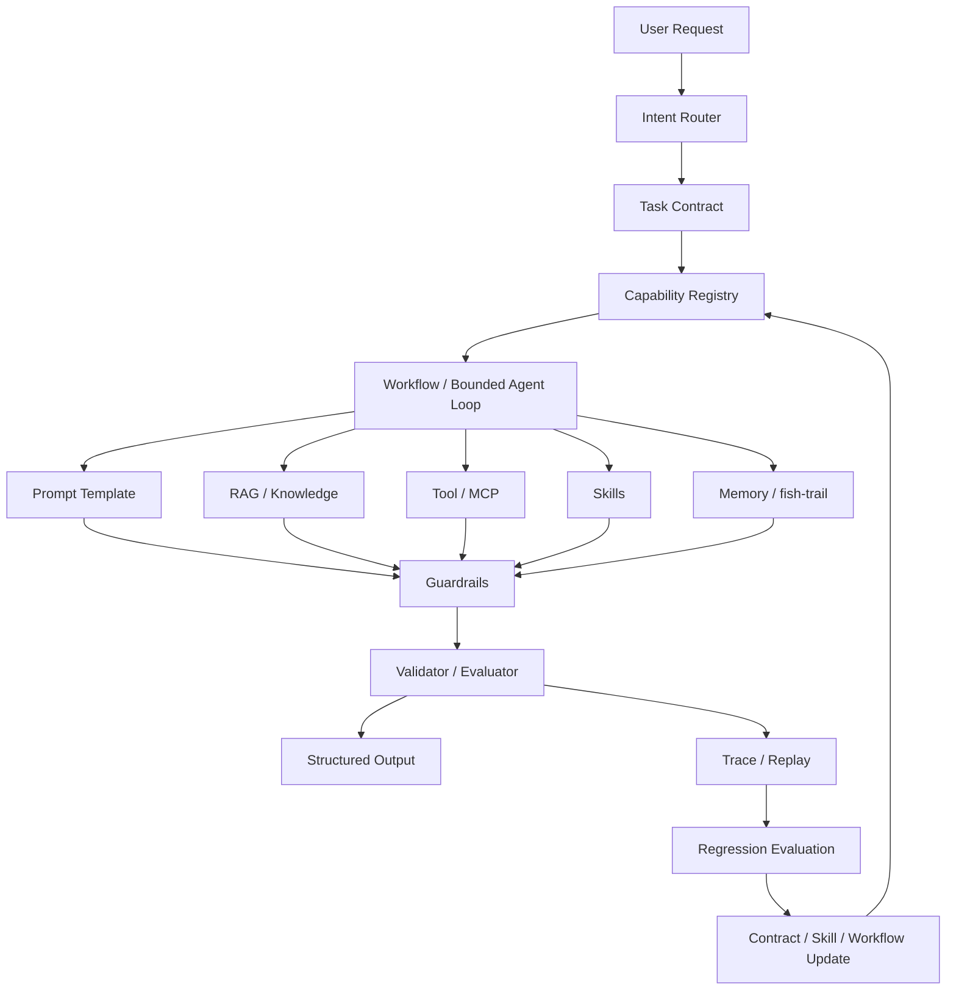

# 稳定 Harness 对 AI Agent 跨模型能力差距的压缩机制研究

## 面向生产力任务的契约驱动、流程约束与能力外置化方法

---

## 0. 方案更新说明

本版研究方案基于一个更精确的核心判断进行更新：

> **本研究并不否定模型能力差异。相反，它承认模型能力差异真实存在，但认为在稳定、明确、可验证的 Agent Harness 框架下，对于一系列生产力任务，模型能力差距会被框架、规则、流程、工具、记忆和评估机制显著压缩。最终产出质量不再主要取决于模型单次自由生成能力，而更多取决于外部制度化约束系统。**

因此，本研究的重点不是证明“弱模型等于强模型”，而是研究：

> **在什么任务类型、什么 Harness 强度、什么约束粒度下，底层模型能力差异会被压缩到什么程度。**

这使研究命题更加严谨，也更接近工程事实。

---

## 1. 核心研究命题

### 1.1 原始命题

随着提示词工程发展为上下文工程、能力编排工程与 Harness Engineering，AI Agent 的行为可以通过 RAG、Tool、MCP、Skills、History Memory、Workflow、Guardrails、Evaluation 等外部机制进行约束，从而使其在生产力任务中产生相对统一的行为与输出。

### 1.2 修正后的核心命题

本研究建议将核心命题修正为：

> **对于可规约、可流程化、可工具化、可验证的生产力任务，Agent Harness Engineering 可以通过外置知识、外置工具、流程约束、状态管理、记忆治理、输出契约和自动评估，显著降低任务结果对底层模型能力差异的敏感性。**

进一步凝练为：

> **稳定 Harness 会压缩模型能力差距。**

或者：

> **Harness 将一部分原本依赖模型隐式智能的工作，迁移为依赖外部制度、工具、流程和验证机制的显式工程。**

这不是“反模型能力”的命题，而是“生产可靠性不应建立在模型自由发挥上”的命题。

---

## 2. 研究对象重新界定

### 2.1 不是研究什么

本研究不主张：

1. 模型能力不重要；
2. 弱模型在任何场景下都能替代强模型；
3. 通过提示词或规则可以完全消除模型差异；
4. Agent 可以不依赖底层模型质量；
5. 所有任务都能被流程化、规约化和验证。

### 2.2 真正研究什么

本研究真正关注：

1. 在生产力任务中，哪些部分可以被 Harness 外置化；
2. 哪些任务中的模型差异可以被显著压缩；
3. 哪些任务仍然强依赖模型能力；
4. 哪些 Harness 组件最能压缩模型差距；
5. 如何度量“模型差距被压缩”；
6. petfish.ai 如何从 Skills 生态演进为 Agent Harness 约束平台。

---

## 3. 人类组织类比：从个人能力到制度化生产

用户提出的人类社会观察是本研究的重要理论起点：

> 在成熟组织中，同一工种的劳动成果不会完全取决于个人智商或教育程度。组织通过岗位定义、SOP、员工手册、工具标准、培训体系、质检流程和复盘机制，将个体能力差异对最终产出的影响控制在可接受范围内。

AI Agent 也可以采用类似机制：

| 人类组织机制 | AI Agent Harness 对应机制 |
|---|---|
| 岗位定义 | Agent role / task contract |
| 员工手册 | System rule / AGENTS.md / policy pack |
| SOP | Workflow / state machine / skill procedure |
| 培训材料 | Few-shot examples / eval cases / skill docs |
| 工具授权 | Tool permission / MCP capability scope |
| 工作台 | Harness runtime |
| 质检流程 | Validator / evaluator / regression test |
| 审批制度 | Human checkpoint / policy gate |
| 绩效指标 | Success rate / consistency / cost / safety metrics |
| 复盘机制 | Reflection / trace review / failure taxonomy |
| 组织记忆 | History memory / fish-trail / project memory |

因此，本研究的核心思想可以表述为：

> **把 AI Agent 当作组织中的岗位，而不是自由聊天对象；把 Prompt 当作制度的一部分，而不是全部；把模型能力放入稳定 Harness 中进行吸收、约束和校准。**

---

## 4. 理论框架：模型能力差距压缩机制

### 4.1 能力差距的来源

不同模型在 Agent 任务中的差距主要来自：

1. **理解差距**：对用户意图、上下文、约束的理解不同；
2. **规划差距**：任务拆解、步骤安排、异常恢复能力不同；
3. **知识差距**：内置知识与实时知识覆盖不同；
4. **工具使用差距**：是否知道何时调用工具、如何解释工具结果；
5. **格式遵循差距**：输出结构、引用、文风、字段完整性不同；
6. **记忆使用差距**：是否正确使用历史上下文；
7. **鲁棒性差距**：面对错误、冲突、模糊输入时恢复能力不同。

### 4.2 Harness 的压缩路径

Harness 并不是直接提升模型智力，而是通过外部机制压缩上述差距：

| 模型差距类型 | Harness 压缩机制 |
|---|---|
| 理解差距 | Intent schema、任务分类器、澄清策略 |
| 规划差距 | Workflow、状态机、SOP、技能流程 |
| 知识差距 | RAG、知识库、引用源、上下文装配 |
| 工具使用差距 | Tool contract、MCP schema、调用策略、权限边界 |
| 格式差距 | Output schema、模板、validator |
| 记忆差距 | Memory policy、topic filter、fish-trail |
| 鲁棒性差距 | Retry policy、error handler、guardrails、human checkpoint |

### 4.3 压缩不是消除

更严谨的表述是：

> **Harness 不是消灭模型能力差异，而是把差异从“不可控的自由生成差异”压缩为“可观测、可约束、可回放、可评估的工程差异”。**

在裸模型场景下，模型差异会直接体现在最终答案上；在 Harness 场景下，差异会被分散到任务识别、流程执行、工具调用、验证失败、重试次数、成本和人工介入率等可度量指标中。


### 4.4 输出一致性是能力差距压缩框架中的必要环节

需要明确区分两件事：

1. **输出一致性不等于模型能力相同**；
2. **输出一致性仍然是压缩模型能力差异的重要 Harness 机制。**

输出一致性主要约束的是最终产物的表达面、结构面和交付面，包括：

- 输出格式；
- 章节结构；
- 字段完整性；
- 命名规则；
- 引用方式；
- 文风与语气；
- 术语使用；
- 排版布局；
- 交付文件规范；
- 面向特定组织或项目的写作惯例。

这些内容本身并不代表模型具备相同的推理、规划或创造能力，但在生产力任务中，它们直接决定交付物是否可用、可审阅、可集成、可复用。

因此，输出一致性应被视为 Harness 的一个关键约束层：

> **输出一致性不是能力无差异的证明，而是通过输出规约吸收和屏蔽模型差异的工程手段。**

在人类组织类比中，这相当于公文模板、报告格式、代码风格规范、设计系统、品牌手册和交付验收标准。不同员工能力可能不同，但只要产物必须遵循统一模板、术语、结构和验收标准，最终交付物的差异就会被压缩到组织可接受范围内。

在 AI Agent Harness 中，输出一致性主要由以下组件实现：

| 输出一致性维度 | Harness 机制 |
|---|---|
| 格式一致性 | Output schema、JSON schema、Markdown template |
| 结构一致性 | Document outline、section contract、artifact template |
| 术语一致性 | Glossary、naming rule、style guide |
| 文风一致性 | Style governor、few-shot examples、review rubric |
| 引用一致性 | Citation policy、evidence ledger、source index |
| 交付一致性 | Artifact contract、file naming、directory convention |
| 质量一致性 | Validator、lint、checklist、human review |

因此，本研究中的“输出一致性”不是独立于能力压缩之外的次要目标，而是完整能力差距压缩链条中的最后一层：

```text
任务理解约束
  -> 流程执行约束
  -> 能力调用约束
  -> 记忆使用约束
  -> 事实来源约束
  -> 输出规约约束
  -> 验证与回归约束
```

其中，输出规约约束负责把前面各层产生的中间差异进一步收敛为稳定、统一、可验收的最终产物。

---

## 5. 任务边界：哪些场景最适合

### 5.1 高适配任务

本研究命题最容易成立的任务包括：

1. 项目初始化；
2. Skill 生成、安装、发布；
3. 文档风格统一；
4. Research workflow；
5. 结构化信息抽取；
6. 配置生成；
7. 代码仓库分析；
8. 测试生成与修复；
9. 企业知识库问答；
10. SOP 型运维任务；
11. 报告模板化生成；
12. 合规检查；
13. Issue 分类与处理建议。

这些任务共同特点是：

- 有明确输入；
- 有相对稳定的流程；
- 有可复用知识；
- 有工具可调用；
- 有输出格式；
- 有验证机制；
- 有失败重试路径。

### 5.2 中等适配任务

这类任务可以被 Harness 部分压缩模型差距，但仍保留较强模型依赖：

1. 开放式研究综述；
2. 复杂代码架构重构；
3. 多约束规划；
4. 产品设计分析；
5. 技术路线评估；
6. 方案批判与改进；
7. 多文档综合判断。

这些任务适合采用 **Bounded Agent Loop**，而不是完全确定性的 Workflow。

### 5.3 低适配任务

这类任务中 Harness 的压缩效果有限：

1. 高度原创研究；
2. 前沿理论突破；
3. 强创造性写作；
4. 审美判断；
5. 价值观判断；
6. 复杂谈判；
7. 模糊目标下的自主战略规划。

在这些任务中，强模型能力仍然是核心变量。

---

## 6. 核心研究问题

本研究建议围绕以下 Research Questions 展开。

### RQ1：稳定 Harness 是否能提升生产力任务成功率？

比较裸模型、Prompt-only、Prompt+Schema、Workflow+Tool、Full Harness 在同一任务集上的成功率。

### RQ2：稳定 Harness 是否能降低跨模型输出差异？

比较不同模型在相同任务、相同 Harness 下的输出结构、事实覆盖、写作方式、术语使用、操作轨迹与最终质量差距。

这里的“输出差异”并不被视为模型能力差异的全部，而是被视为能力差距压缩链条中最容易被规约、模板化和验证的一部分。

### RQ3：不同 Harness 组件对能力差距压缩的贡献分别是多少？

通过 ablation study 分析：

- Schema；
- RAG；
- Tool/MCP；
- Skills；
- Workflow；
- Memory；
- Validator；
- Human checkpoint；
- Trace/replay。

### RQ4：不同任务类型的模型差距压缩程度是否不同？

验证高规约任务、中规约任务、低规约任务中 Harness 的收益差异。

### RQ5：Harness 是否会带来新的工程代价？

评估：

- 开发成本；
- 运行成本；
- Token 成本；
- 延迟；
- 维护复杂度；
- Contract drift；
- Memory pollution；
- Tool security risk。

### RQ6：能否形成一种“制度化 Agent 生产”范式？

验证 petfish.ai 是否可以从 Skill Installer 演进为：

- Capability Registry；
- Workflow Runtime；
- Memory Governance；
- Verification Layer；
- Evaluation Harness；
- Agent SOP Platform。

---

## 7. 研究假设

### H1：任务可规约性越高，Harness 对模型差距的压缩越明显

结构化抽取、项目初始化、配置生成等任务将表现出最高收益。

### H2：Harness 强度越高，跨模型输出方差越低

从 Prompt-only 到 Full Harness，模型间输出差距应逐步下降。

### H3：Workflow 与 Validator 是压缩差距的核心组件

RAG 提供知识，Tool 提供能力，但真正压缩行为差距的是 Workflow 和 Validator。

### H4：Memory 能提升连续性，但也可能引入污染

受控 Memory policy 能提升任务连续性；不受控记忆会放大错误和主题污染。

### H5：强模型仍然在异常恢复和开放推理中显著占优

Harness 可以压缩常规生产任务差距，但无法完全替代强模型在开放任务中的优势。

---

## 8. 总体技术架构



该架构的本质是：

> **把模型放在 Harness 内部，而不是把 Harness 当作模型回答之后的补丁。**

---

## 9. petfish.ai 的定位更新

### 9.1 当前 petfish.ai 的价值

petfish.ai 已经具备以下关键积累：

1. Skills / Skill Packs；
2. Core / Optional Packs；
3. Project Initializer；
4. Research Skill Pack；
5. Reflection Skill；
6. Series Style Governor；
7. MCP Server；
8. Installer / Remote Installer；
9. Skill Market；
10. fish-trail；
11. Context injection；
12. Trigger eval / smoke test；
13. CI 与 manifest 校验。

这些积累说明 petfish.ai 已经不是普通 prompt 仓库，而是一个正在形成中的 Agent Harness 生态。

### 9.2 petfish.ai 的下一步定位

建议将 petfish.ai 的定位从：

> **Self-adaptive skill installer for AI-assisted projects**

升级为：

> **Contract-driven harness platform for reliable AI agent workspaces**

中文定位：

> **面向 AI Agent 工作区的契约驱动 Harness 平台**

进一步产品化表达：

> **用 Skills、Workflow、Memory、Tool 和 Eval，把 AI Agent 从自由发挥约束为稳定生产。**

### 9.3 petfish.ai 的核心演进方向

从“多做 Skills”转向“治理 Skills”：

| 当前能力 | 下一步演进 |
|---|---|
| Skill Pack | Capability Contract |
| Installer | Registry-driven Installer |
| Project Initializer | Task Contract Resolver |
| AGENTS.md | Policy / SOP Injection |
| fish-trail | Memory Governance |
| Trigger Eval | Evaluation Harness |
| MCP Server | Tool Contract Runtime |
| Skill Market | Capability Registry + Quality Gate |
| CI | Contract Drift Detection |
| Reflection | Failure Taxonomy + Regression Update |

---

## 10. 实验设计更新

### 10.1 实验核心：测量“模型差距压缩率”

原方案主要测成功率和一致性。本版新增核心指标：

## Model Capability Gap Compression Ratio

定义：

```text
Gap_baseline = PerformanceGap(models, prompt_only)

Gap_harness = PerformanceGap(models, full_harness)

CompressionRatio = 1 - Gap_harness / Gap_baseline
```

其中 PerformanceGap 可以按任务选择：

- 成功率差距；
- 质量评分差距；
- Schema 有效率差距；
- 引用正确率差距；
- Tool 调用正确率差距；
- Human acceptance rate 差距。

如果 CompressionRatio 越高，说明 Harness 越有效压缩模型能力差距。

### 10.2 其他指标

#### 输出一致性

```text
OutputConsistency = similarity(outputs across models and repeated runs)
```

输出一致性可以进一步拆分为：

```text
FormatConsistency
StructureConsistency
StyleConsistency
TerminologyConsistency
CitationConsistency
ArtifactConsistency
```

其中，Format / Structure / Terminology 更容易通过规则和 schema 约束；Style / Writing Pattern 更依赖示例、风格治理器和人工评分；Citation / Artifact 则适合通过 evidence ledger、文件命名规范和 validator 检查。

#### 轨迹一致性

```text
TrajectoryConsistency = similarity(tool calls + workflow states + memory events)
```

#### 任务成功率

```text
TaskSuccessRate = successful_tasks / total_tasks
```

#### Contract 遵循率

```text
ContractCompliance = passed_contract_checks / total_contract_checks
```

#### 人审负担

```text
HumanReviewBurden = human_interventions / task
```

#### 成本效率

```text
CostEfficiency = task_success / token_cost
```

#### 异常恢复能力

```text
RecoveryRate = recovered_failures / total_failures
```

---

## 11. 实验分组

### 11.1 模型组

选择不同能力层级的模型：

1. Strong Model；
2. Mid Model；
3. Budget Model；
4. Long-context Model；
5. Fast Model；
6. Local / Quantized Model。

### 11.2 Harness 强度组

| 组别 | 说明 |
|---|---|
| G0 | 裸 Prompt |
| G1 | Prompt + Role + Instruction |
| G2 | G1 + Output Schema |
| G3 | G2 + RAG |
| G4 | G3 + Tool / MCP |
| G5 | G4 + Skills |
| G6 | G5 + Workflow |
| G7 | G6 + Memory Policy |
| G8 | G7 + Validator / Eval |
| G9 | Full Harness + Trace + Regression |

### 11.3 任务组

| 任务类型 | 可规约性 | 预期压缩效果 |
|---|---:|---|
| 结构化抽取 | 高 | 极强 |
| 项目初始化 | 高 | 很强 |
| Skill 生成 | 高 | 很强 |
| 配置生成 | 高 | 很强 |
| 文档风格治理 | 中高 | 强 |
| Research workflow | 中 | 中强 |
| 代码修复 | 中 | 中强 |
| 架构评审 | 中低 | 中 |
| 战略判断 | 低 | 弱 |
| 创造性写作 | 低 | 弱 |

---

## 12. 预期实验结论

本研究不应预设所有任务都会显著压缩差距。更合理的预期是：

1. 在高规约任务中，Full Harness 可显著压缩模型差距；
2. 在中规约任务中，Harness 能提高下限，但强模型仍有优势；
3. 在低规约任务中，Harness 更像质量辅助系统，而不是能力替代系统；
4. Workflow、Validator、Schema 对一致性贡献最大；
5. RAG 和 Tool 对事实正确性与能力边界贡献最大；
6. Memory 同时带来连续性收益和污染风险；
7. Full Harness 会增加工程复杂度，但能提升可治理性；
8. 强模型在异常恢复、开放推理、冲突判断中仍然重要。

---

## 13. 学术贡献更新

### 13.1 更准确的论文主线

建议论文主线从：

> AI Agent 行为一致性研究

更新为：

> **Harness 如何压缩 AI Agent 生产力任务中的跨模型能力差距**

这比单纯谈“一致性”更有研究张力，也更容易形成实验指标。

### 13.2 可能论文题目

1. **Can Agent Harnesses Compress Model Capability Gaps?**
2. **Harness Engineering for Model-Portable AI Agents**
3. **Contract-Driven Agent Harnesses for Reliable Productivity Tasks**
4. **From Model Intelligence to Institutionalized Agent Production**
5. **Stabilizing AI Agents: Workflow, Skills, Memory and Evaluation as Capability Gap Compressors**

### 13.3 核心贡献

1. 提出 **Model Capability Gap Compression** 概念；
2. 提出 Contract-driven Agent Harness 架构；
3. 构建 petfish.ai 原型系统；
4. 提出跨模型、跨任务、跨 Harness 强度的评测方法；
5. 通过 ablation study 分析各 Harness 组件对能力差距压缩的贡献；
6. 总结生产力任务中 Harness 有效与无效的边界。

---

## 14. 工程路线更新

### 阶段一：统一 Registry，消除 Contract Drift

目标：

- 所有 Skill、Pack、MCP、Workflow、Memory Policy 进入统一 Capability Registry；
- Installer、Market、Docs、AGENTS.md 注入都从 Registry 生成；
- CI 检查 Registry 与仓库事实是否一致。

### 阶段二：Project Initializer 进入 Contract-driven 模式

目标：

- 从静态 profile mapping 改为动态 skill discovery；
- 用户意图 -> Task Contract；
- Task Contract -> Capability Resolution；
- Capability Resolution -> Install Plan；
- Install Plan -> Human Review / Auto Apply。

### 阶段三：Workflow Runtime

目标：

- 对高规约任务使用状态机；
- 对中规约任务使用 bounded agent loop；
- 每个 workflow 有输入、状态、工具、记忆、输出、验证 contract。

### 阶段四：fish-trail Memory Governance

目标：

- 从简单 history/compaction 升级为 Memory Policy；
- 支持 topic filter；
- 支持 memory write reason；
- 支持 TTL；
- 支持 memory pollution detection；
- 支持 memory trace。

### 阶段五：Evaluation Harness

目标：

- 跨模型运行；
- 跨任务运行；
- 跨 Harness 强度运行；
- 自动计算能力差距压缩率；
- 生成 regression report。

---

## 15. 风险更新

### 15.1 过度宣称风险

不能说：

> Harness 让弱模型等于强模型。

应该说：

> Harness 在特定生产力任务边界内压缩模型差距，提高弱模型可用下限，同时保留强模型在开放推理和异常恢复中的优势。

### 15.2 过度工程化风险

如果任务本身简单，Full Harness 的成本可能超过收益。

解决方式：

- 引入 Harness strength selection；
- 对不同任务使用不同约束强度；
- 避免所有任务都套最大流程。

### 15.3 Memory 污染风险

Memory 不是越多越好。错误记忆会让模型更稳定地犯错。

解决方式：

- Memory Contract；
- Topic filter；
- TTL；
- Conflict resolution；
- Human-confirmed memory；
- Memory evaluation。

### 15.4 Workflow 僵化风险

过强流程可能降低开放任务探索能力。

解决方式：

- 高规约任务用 workflow；
- 中规约任务用 bounded loop；
- 开放任务用 advisory harness；
- 保留 human checkpoint。

---

## 16. 更新后的最终判断

这个方向是正确且有价值的，但最强的表述不是“模型能力不重要”，而是：

> **在稳定、明确、可验证的 Agent Harness 下，生产力任务中的模型能力差距会被显著压缩。**

这句话同时保留了三个事实：

1. 模型能力差异真实存在；
2. 生产力任务可以被流程、工具、知识、记忆和验证机制部分制度化；
3. 制度化 Harness 可以提高弱模型下限、降低强弱模型差距、提升整体可治理性。

对于 petfish.ai 来说，下一阶段的关键不只是继续扩充 Skills，而是将已有 Skills、Packs、MCP、Installer、Memory、Eval 和 CI 收敛成一个完整的 Contract-driven Harness 平台。

最终目标可以定义为：

> **petfish.ai 要证明：AI Agent 的稳定生产力，不只来自更强模型，也来自更好的制度化运行框架。**

---

## 17. 一句话研究纲领

> **我们研究的不是“模型是否重要”，而是“当生产力任务被稳定 Harness 制度化之后，模型能力差距如何被吸收、缓冲、压缩和治理”。**
