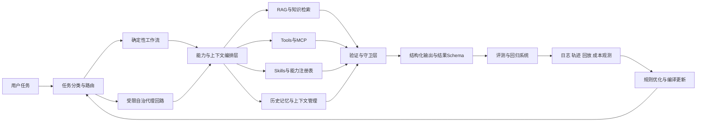

# Harness Engineering 约束 AI Agent 行为一致性的研究评估

## 执行摘要

你的方向**部分正确，而且在不少高价值任务上是可行的**，但它并不是一个“对所有 agent 任务都成立”的普遍规律。更准确的表述应当是：**通过 harness engineering，把任务中的不确定性从“模型内部的隐式推理”迁移到“系统外部的显式结构、工具、检索、记忆、验证与评测”，确实可以显著提高输出一致性、可审计性和模型可替换性；但它只能降低，不可能普遍消除，对底层模型能力的依赖。** Anthropic 对“augmented LLM”“workflow”“agent”的区分、LangGraph 对 runtime 与 harness 的分层、Pydantic AI Harness 对能力库的模块化表达、DSPy 对“program, don’t prompt”的编译式优化、以及 OpenAI / Outlines / Guardrails 的结构化与验证机制，本质上都在朝同一个方向收敛。citeturn14view0turn11view0turn30view0turn4academia0turn18view0turn29view0turn12view2

从工程价值看，这个方向**非常强**。它直接对应企业最关心的几件事：跨模型迁移成本、可回放与可审计、策略合规、人审插点、工具边界、安全与成本控制。Anthropic 明确建议先用简单、可组合的 workflow，而不是一上来就做完全自治 agent；LangGraph、AutoGen、Semantic Kernel、Pydantic AI、Guardrails、Letta 等主流框架，也都在把“工作流、状态、记忆、工具、守卫、评估、观测”做成显式系统层。citeturn14view0turn11view0turn5view2turn12view1turn12view0turn12view2turn24view0

从学术价值看，这个方向也**足够成立**，但研究对象不应只叫“prompt engineering 的升级版”，而更应被定义为**agent harness / orchestration / capability library / declarative guardrails / workflow verification**。核心研究点不是“怎样写更强提示词”，而是：哪些能力应该外置；哪些状态应该显式管理；哪些行为应该强制验证；以及在什么任务边界内，系统约束可以真正压缩模型差异。DSPy、RAG、Toolformer、Gorilla、MemGPT、AgentSPEX、Semantic Integrity Constraints、Agentproof、LlamaFirewall 等工作分别从编译优化、检索增强、工具使用、外部记忆、显式工作流、约束声明、静态验证和守卫监控这些侧面构成了这条研究谱系。citeturn4academia0turn3academia2turn3academia1turn4academia1turn3academia3turn22view0turn21view0turn20view1turn28view0

但以批判性视角看，你原命题里最值得修正的一点是：**“不会受到模型能力的显著影响”这句过强。** 现有证据更支持“在可规约、可验证、可工具化的任务子空间中，影响会明显下降”；而在开放式规划、模糊语义判断、复杂异常恢复、跨技能组合、对抗输入与长链自纠错中，底层模型能力依然强烈影响最终结果。Anthropic 也明确指出 workflow 适合定义清晰、追求预测性与一致性的任务，而 agent 更适合必须依赖模型自主决策的开放问题；OpenAI 的结构化输出虽然能强制模式遵循，但官方也提醒：若输入与 schema 不匹配，模型仍可能为了满足 schema 而“结构化地胡说”；OAgents 则指出 agent 研究常因评测协议不稳定而出现高方差和不可复现。citeturn14view0turn18view1turn20view0

对你指定仓库 `kylecui/petfish.ai` 的结论是：**它已经是一个非常接近“harness engineering 实验田”的系统**。仓库中已经有模块化 pack、skills、MCP server、插件式上下文注入、历史压缩、安装器、市场分发、质量门禁、触发评测与 smoke test 等关键组件；而且项目作者显然已经不满足于“写规则”，而是在往“协议 + 注册表 + 能力库 + 评估”推进。与此同时，该仓库也暴露了这一方向最真实的难点：**架构迁移后的文档/代码漂移、安装器与注册表同步问题、模型特异性收益、memory/compaction 的架构上限、以及 MCP/工具链的安全与可维护性。** 这恰恰证明：你的方向是对的，但要走到“真正统一行为输出”的终点，关键不在更多 prompt，而在**更强的 contracts、registries、verifiers、telemetry 和 evaluation discipline**。fileciteturn33file0L14-L18 fileciteturn33file0L23-L91 fileciteturn49file0L4-L47 fileciteturn36file0L3-L48 fileciteturn38file0L1-L1 fileciteturn41file0L1-L1 fileciteturn42file0L1-L1 fileciteturn43file0L1-L1

## 批判性分析

### 这个方向为什么成立

如果把 agent 的输出质量拆成几个来源，你的思路实际是在做一件很清晰的系统工程：把**事实获取**交给 RAG，把**外部行动**交给工具，把**能力复用**交给 skills / MCP，把**长程状态**交给 memory，把**最终结果**交给 schema / validator / tests，把**流程决策**交给 workflow / router / orchestrator。这种做法的根本价值，是让“成功与失败”的决定因素，不再主要埋在模型的一次性自由生成里，而改为落在一组可观察、可调试、可替换、可测试的组件上。Anthropic 把 retrieval、tools、memory 直接视为 augmented LLM 的基本增强件；LangGraph 把 durable execution、human-in-the-loop、persistence、memory 作为 orchestration runtime 的核心；Pydantic AI Harness 则把 context management、memory、guardrails、filesystem、code execution、multi-agent orchestration 都定义为可选 building blocks。citeturn14view0turn11view0turn30view0

学术上，支持你这条路的最强证据之一，是很多工作都已经证明：**把能力外置，的确能让小模型或普通模型在特定子任务上逼近甚至超过更大模型的“裸跑”效果。** RAG 通过显式非参数记忆提升知识密集型任务表现并提供可更新性与可追溯性；Toolformer 证明模型可以学会何时调用何种 API；Gorilla 则进一步显示，带检索的 API 调用模型在 API call 写作上可以超过 GPT-4，并能适应文档版本变化；DSPy 则展示了把 LM pipeline 写成可编译、可优化的程序后，小模型与开放模型在若干任务上可以接近依赖专家 prompt 的更大闭源模型。citeturn3academia2turn3academia1turn4academia1turn4academia0

工程上，这条路最重要的收益不是单点 accuracy，而是**系统稳定性**。工作流拆解、验证器、静态 schema、tool search、日志与回放，会让系统更容易做错误定位、A/B 测试、版本回归和跨模型迁移。Anthropic 明确主张先从简单、可组合的模式开始，只有在确有必要时才增加 agent 自主性；AutoGen 也把 Core 定义为 event-driven、多 agent 的基础编程框架；Semantic Kernel 把自己定位为轻量、模块化、可观测的 middleware；OpenAI 和 Outlines 则都把“严格遵循 schema 的结构化输出”放到了系统约束层，而不是靠自然语言祈祷模型“按格式来”。citeturn14view0turn5view2turn12view1turn18view0turn18view3turn29view0

### 这个方向哪里不成立

最大的误区，是把“输出一致性”与“能力无关”混为一谈。**一致性是对自由度的压缩，不是对能力差异的抹除。** 只要任务中还存在以下任何一项，底层模型能力就仍是主要变量：一是复杂的语义歧义消解，二是工具何时该用与何时不该用的判断，三是多步计划的异常恢复，四是面对不可靠检索结果时的过滤与整合，五是对长程上下文中“什么该记住、什么该忘掉”的策略选择。Anthropic 把 workflow 和 agent 分开，正说明了这一点：workflow 的价值在于预测性，agent 的价值在于弹性；只要你还需要弹性，你就还需要模型本身的判断力。citeturn14view0

OpenAI 的结构化输出文档也给了一个非常典型的反例：schema 约束可以保证“长得像你要的结果”，但**不能保证语义上就是真的**。官方明确提示，模型会尽力遵循给定 schema，因此当用户输入与 schema 任务根本不相容时，依然可能出现为了满足结构而产生的 hallucination。也就是说，约束能够锁住“形式正确”，却不能自动锁住“内容真实”。这正是为什么 harness 不能只有 format constraint，还必须有 grounding、retrieval provenance、tool verification 和 post-hoc validators。citeturn18view0turn18view1turn12view2turn21view0

同样，memory 也不是天然增益。MemGPT 与 Letta 的思路表明，层级记忆、archival memory、context hierarchy、stateful agent 确实能扩展系统的长期状态能力；但这带来的不是“无代价稳定”，而是新的选择压力：写入什么、何时摘要、如何检索、如何避免旧记忆污染新任务。记忆系统一旦设计不当，反而会制造更加稳定地重复错误。citeturn3academia3turn24view0

### 这条路真正可行的边界

如果把任务按“可规约程度”和“可验证程度”划分，这条路在三类任务上的前景差异很大。**高可规约、高可验证**的任务最适合，例如结构化抽取、SQL / API 调用、工作流路由、文档问答、代码修改配合自动测试、报表生成配合 schema 与 checker。这类任务的成功标准可被外部定义，模型只是执行一个受约束的搜索。Anthropic 甚至把“代码任务之所以适合 agent”归因为测试可验证、问题空间结构化、输出质量可客观衡量。citeturn14view0

而**低可规约、低可验证**任务，例如高度开放的研究判断、品牌语气塑造、复杂谈判、社会语境推理、隐含目标协调，就很难靠 harness 把模型差距压到不显著。这里你仍然需要更强的概括能力、审美、抗干扰、反事实推理与自纠错能力。OAgents 对 GAIA 和 BrowseComp 的系统实验也提醒我们：agent 设计选择的效果常常高度依赖评测协议与运行方差，很多看起来“合理”的组件并不稳定地产生增益。citeturn20view0

归纳起来，**你的命题成立于“把任务工厂化”的工程方向，不完全成立于“把智能能力替代掉”的理论方向。** 这不是一个坏消息，反而意味着你真正抓住了 agent 产业化中最现实也最有价值的部分：不是让模型在所有事情上都像最聪明的人，而是让系统在足够多的事情上像最稳定的流程。这个判断与 Anthropic 对 workflow 的强调、DSPy 对 pipeline 编译优化的设计、Pydantic Harness 对 building blocks 的表达、以及 AgentSPEX / Agentproof 对显式控制流和静态检验的追求，是一致的。citeturn14view0turn4academia0turn30view0turn22view0turn20view1

## 对 kylecui/petfish.ai 的具体审阅

### 这个仓库已经做对了什么

`kylecui/petfish.ai` 不是一个单纯的 prompt 仓库，它已经具备了明显的 **harness 系统雏形**。项目自述把主仓库定位为“所有源码、core + optional packs、skills、文档、网站、CI/CD”的主单仓库，并将其与 market、remote、tester、opencode fork、trustskills 等外围子系统串成一个分布式生态；核心目录则已经明确区分 `packs/core` 与 `packs/optional`，并把 companion、toolchain、project initializer、fish-trail 视为基础层，把 research、deploy、course、style、governance、reflection 等视为按需能力层。fileciteturn33file0L14-L18 fileciteturn33file0L23-L91

更关键的是，仓库已经把“能力发现”做成了明确接口，而不是只靠系统提示词。`skill-registry` MCP server 明确使用 stdio 上的 JSON-RPC 2.0，兼容 `Content-Length` framing 与 bare JSONL 两种传输方式，并公开了 `list_installed_packs`、`list_available_packs`、`search_skills`、`get_pack_info`、`get_profile_mapping` 五个工具。这意味着至少在设计上，项目已经把“技能可见性、能力枚举、包级元数据、profile 到 pack 的解析”抽象成独立服务层，而不是让模型在自然语言里自己“猜”系统里有什么。fileciteturn34file0L3-L11 fileciteturn34file0L138-L208

仓库的运行时配置也已经体现了多层 harness 思维。根目录 `opencode.json` 同时启用了四类插件与三个本地 MCP：系统提示规则注入、fish-trail compaction、topic context filter、system prompt context inject，以及 `context-state`、`skill-registry`、`usage-cost` 三个 MCP 进程。这个组合说明项目并不把“约束”理解成单一 system prompt，而是理解成**运行时上下文管理 + 能力查询 + 成本观测 + 状态插件**的叠层机制。fileciteturn49file0L4-L47

从 pack 设计看，项目也已经在做能力模块化和流程模板化。`research-skill-pack` 的 manifest 显示，这个 optional pack 一次性定义了 54 个 research workflow skills，并把 source index、literature access、excerpt notes、insight log、evidence ledger、quality review 等 schema、脚本、样例和 trigger eval 一并纳入。这非常像“把研究工作程序化”：不是只给一个总提示，而是把研究拆成可组合、可校验、可审计的工作单元。fileciteturn29file0L4-L203

项目的演化路径也支持这一判断。v1.4 的 PR 明确写出“Market-First Distribution”“core/optional split”“market integration”“skill-publish tool”“remote installer market hooks”等变更；v1.4.9 又继续扩展 `skill-author` 的 authoring mode、quality gate checklist、非空 eval、handoff boundary 与模板资产；v1.4.10 则是围绕 installer、alias、agents-rules 做快速修复。这说明 petfish.ai 的真实重心不是“写更多技能”，而是逐步把**技能工厂、分发系统、安装协议、别名映射、质量门禁和市场机制**做成统一底座。fileciteturn44file0L8-L33 fileciteturn46file0L8-L33 fileciteturn47file0L8-L33

项目还具备了最低限度但方向正确的评估纪律。CI 明确会在 Ubuntu 与 Windows 上执行 pytest，总体测试、manifest 校验、install script 校验、research pack smoke test 和 research pack trigger eval；其中 `tests/test_install_scripts.py` 还会直接从 `catalog_query.py` 导入 canonical alias 做脚本一致性检查，并对安装器的旧版数组格式 registry 兼容性做回归测试。也就是说，项目已经意识到：**harness 的核心不是单个技能是否“会写”，而是注册表、安装器、别名、market hook、兼容层之间是否持续一致。** fileciteturn36file0L3-L48 fileciteturn37file0L3-L27 fileciteturn37file0L139-L181

### 这个仓库暴露出的真实问题

首先，**架构迁移后的代码与文档漂移**已经出现。仓库全景文档明确说明 `packs/` 已拆分为 `core/` 与 `optional/` 两层目录；但 `skill-registry/server.py` 中 `_read_all_manifests()` 仍按 `packs/<entry>/pack-manifest.json` 的扁平目录假设扫描，而 `_load_profile_mapping()` 试图从 `packs/petfish-companion-skill/...` 读取路径，也没有体现 `core/` 分层。这至少表明：在你要研究的“标准化 harness”世界里，**最大的敌人不是模型不听话，而是系统自身的 contract drift**。如果 registry、installer、docs、market、tests 不同步，模型再强也只能在过时对齐对象上工作。fileciteturn33file0L29-L63 fileciteturn35file0L3-L20 fileciteturn35file0L62-L125

其次，项目自己已经在 issue 里承认了**静态映射会快速腐化**。Issue #209 直指 `project-initializer` 中硬编码的 pack 分类与 profile→pack 映射在新 release 后持续过时，并提出应该改成“profile-first、intent-backup”的动态发现机制；Issue #141 也明确指出 4 个安装器各自维护 pack lists 是 sync problem 的根源，建议统一改为 runtime 读取 manifest。换句话说，petfish.ai 正在从“规则库”迈向“注册表驱动系统”，而这正是你的研究应该继续推进的地方。fileciteturn38file0L1-L1 fileciteturn41file0L1-L1

第三，项目已经拿到了一个对你原命题非常关键的**反证**：同一种 harness 改造，不同模型收益不一致。Issue #170 的压缩消融 benchmark 显示，在 `full-v2`、`disk-compact`、`disk-full` 三个 arms 下，Claude Sonnet 4.6 出现了 `disk-full` 优于 baseline 的情况，而 DeepSeek Flash 与 GPT-5.4-Mini 两个模型却都没有从 disk arms 中受益，甚至更差。这说明 memory injection / compaction / focus block 之类 harness 手段，不能被想当然地看作“模型无关”。它们往往仍然依赖模型对额外结构的利用能力、缓存策略、工具回路以及 token accounting 方式。fileciteturn43file0L1-L1

第四，petfish 已经在 fish-trail 上碰到了**架构极限**。Issue #135 说明 Phase 2 的 compaction plugin 因为只改 compaction summary prompt，而不拦截 per-request message assembly，所以从架构上就“不可能”节省每次请求的输入 token；因此才提出走 `experimental.chat.messages.transform` 的 Phase 3。这个例子非常重要，因为它说明 harness engineering 的关键不是“约束一切”，而是先搞清楚**你到底能在系统哪一层施加约束**。如果你的 hook 点选错了，再聪明的设计也只能变成“更整洁但并不更省”的装饰。fileciteturn42file0L1-L1

第五，项目还暴露了**分发链与环境链的脆弱性**。Issue #211 指出 `remote-install.ps1` 在网络慢/不稳定时因缺少 `TimeoutSec` 而无法切换镜像；Issue #212 指出 `install.ps1` 在脚本不从 repo root 执行时会解析错误的 `PacksDir`，导致“0 packs installed”；Issue #200 则进一步指出 registry schema 仍假设 one-pack-per-repo，不利于 monorepo / subdir 场景。对任何想做通用 harness 的系统来说，这意味着：**协议标准化之后，真正的工程难点会迅速转移到环境解析、源地址治理、artifact 取回、版本锁定与供应链安全。** fileciteturn40file0L1-L1 fileciteturn39file0L1-L1 fileciteturn48file0L1-L1

### 如何把 petfish.ai 扩展成更通用的 harness 框架

沿着 petfish 现有方向，最值得做的不是再加一批 skills，而是把现有系统升级为**四层 contract**。第一层是 **capability contract**：每个 pack / skill / tool / MCP 都有统一 manifest、输入 schema、输出 schema、版本约束、依赖关系、权限需求与安全标签。第二层是 **workflow contract**：router、orchestrator、worker、evaluator、optimizer 之间的状态流、终止条件、人审节点、可回滚边界要显式化，最好最终不只是写在 SKILL.md，而是变成机器可校验的 workflow spec。第三层是 **memory contract**：长期记忆的写入理由、TTL、作用域、召回规则、topic 分桶、压缩方式和冲突解决都要独立声明。第四层是 **verification contract**：schema adherence、tool success、citation grounding、trajectory conformance、policy gates 与 cost SLA 都要变成自动评测项。这个方向与 LangGraph 的 durability / memory / HITL、Pydantic AI Harness 的 capability library、AgentSPEX 的显式状态与 graph execution、以及 SIC / Agentproof 的声明式约束和静态校验是完全同向的。citeturn11view0turn30view0turn22view0turn21view0turn20view1

对 petfish 本身，近期最优先的动作是把 **manifest / registry / installer / market / tests / docs** 收敛成单一事实源。Issue #141 已经清楚指出“all 4 installers maintain their own pack lists”是根因；Issue #209 又说明 profile→pack 静态表会变成维护陷阱。换言之，petfish 当前最缺的不是“更多 agent 智能”，而是**更强的一致性编译链**：从 pack-manifest 到 registry，再到 installer、AGENTS 注入、market index、docs-site 和 eval data 的生成，最好都由同一套编译步骤自动产出，而不是靠手工同步。fileciteturn41file0L1-L1 fileciteturn38file0L1-L1

## 相关研究与项目对比

下面这张表把与你命题最相关的一组论文、产品和开源框架放在同一坐标系里。表中的“成熟度”和“可复现性”是基于文档完备度、是否开源、是否有 eval / observability / workflow contracts、以及是否面向生产系统的**综合判断**，不是这些项目自报的官方评级。相关来源放在最后一列，点击引用即可直达。  

| 名称 | 类型 | 关键方法 | 主要约束手段 | 开源 | 成熟度 | 可复现性 | 来源 |
|---|---|---|---|---|---|---|---|
| petfish.ai | 开源工程系统 | pack + skills + MCP + plugins + installers + gate + market | AGENTS 规则、skills、MCP registry、context plugins、CI/evals | 是 | 中 | 中 | fileciteturn33file0L23-L91 fileciteturn49file0L4-L47 fileciteturn36file0L3-L48 |
| Anthropic MCP + Agent Skills | 标准与产品能力 | MCP 统一工具协议；filesystem-based skills 渐进加载 | 协议标准化、技能元数据、按需装载、工具接口规范 | 是 | 高 | 中高 | citeturn5view0turn26view0turn14view0 |
| LangGraph + Deep Agents | 开源框架 / 运行时 | 低层 orchestration runtime，支持 persistence、HITL、memory；Deep Agents 作为 harness | graph workflow、state、时间旅行、持久化、人工中断、trace/eval | 是 | 高 | 高 | citeturn11view0 |
| AutoGen | 开源框架 | AgentChat + Core + Extensions + Studio | event-driven runtime、多 agent 协作、MCP extension、code executor | 是 | 高 | 中高 | citeturn5view2 |
| DSPy | 论文 + 开源框架 | 把 LM pipeline 写成声明式程序并编译优化 | signature、module、metric、optimizer、可编译 pipeline | 是 | 高 | 高 | citeturn4academia0turn5view3 |
| Pydantic AI + Harness | 开源框架 | type-safe agent + capability library + evals | typed output、hooks、MCP、guardrails、memory、context management、harness capabilities | 是 | 高 | 高 | citeturn12view0turn30view0 |
| Guardrails AI | 开源守卫框架 | input / output guards + validators + structured data | 输入输出校验、risk validator 组合、structured generation | 是 | 中高 | 中高 | citeturn12view2 |
| Letta / MemGPT | 论文 + 产品 / 开源文档 | stateful agents + hierarchical / archival memory | context hierarchy、memory blocks、archival memory、MCP tools、evals | 是 | 中高 | 中 | citeturn3academia3turn24view0 |
| Outlines | 开源结构化生成库 | generation-time grammar / schema constraint | JSON Schema、regex、CFG、provider-independent structured decoding | 是 | 中高 | 高 | citeturn29view0 |
| AgentSPEX | 论文原型 | 显式 agent 规格语言 + agent harness | typed steps、branching、loops、state、checkpoint、verification | 原型公开倾向强 | 中 | 中高 | citeturn22view0 |

如果把这些项目放在同一张图里看，会发现它们其实分成三条路线。第一条是 **运行时路线**，代表是 LangGraph、AutoGen、Semantic Kernel、Pydantic AI；第二条是 **能力与协议路线**，代表是 MCP、Agent Skills、petfish.ai 的 pack / registry / market 思路；第三条是 **验证与约束路线**，代表是 Guardrails、Outlines、SIC、Agentproof、LlamaFirewall。你要做的不是从零发明第四条路，而是**把这三条路合并成一个统一工程学：运行时负责执行，协议层负责能力发现，约束层负责正确性与安全。** citeturn11view0turn5view2turn12view1turn12view0turn5view0turn26view0turn12view2turn29view0turn21view0turn20view1turn28view0

从论文维度看，与你命题最直接相关的结论可以概括为三句。第一，RAG、Toolformer、Gorilla、MemGPT 和 ReAct 共同证明：**外置知识、工具和环境反馈，能系统性改善裸模型的弱项。** 第二，DSPy 与 AgentSPEX 说明：**把 agent 流程写成程序，而不是写成长 prompt，确实更适合优化、修改和复现。** 第三，SIC、Agentproof、LlamaFirewall 和 MCP 安全研究提醒我们：**一旦 agent 真正进入现实系统，问题就立即从“回答好不好”升级为“运行是否可验证、接口是否可治理、工具是否会被污染、链路是否安全”。** citeturn3academia2turn3academia1turn4academia1turn3academia3turn3academia0turn4academia0turn22view0turn21view0turn20view1turn28view0turn27view0

## 工程路线图与实验方案

### 通用 harness 框架

下面这张图给出一个更通用、也更适合从 petfish.ai 演化出去的 harness 架构。它的原则是：**把模型放在“受控但不被过度拟合”的位置上，让事实、动作、状态、验证和评估尽量外置。**

这不是单纯的软件分层图，而是一个**研究分层图**。RAG 解决外部事实；tools / MCP 解决行动接口；skills 解决流程模板与领域知识复用；memory 解决长期状态；validators / guardrails 解决语法、语义与安全；evals / telemetry 解决是否真的降低了模型依赖。Anthropic 对 augmented LLM、workflow 与 agent 的区分，LangGraph 的 orchestration runtime，Pydantic Harness 的 capability library，AgentSPEX 的 customizable harness，以及 Agentproof / SIC 的静态与声明式约束，都可以被吸收到这一框架中。citeturn14view0turn11view0turn30view0turn22view0turn20view1turn21view0

### 分阶段工程路线图

**第一阶段**应该只做一件事：把“流程自由度”收紧到可测。具体来说，先统一 pack / skill / tool / MCP / memory 的 manifest 与 version contract，再把所有输出改成可检查的 schema 或 artifact 类型，同时补齐 trace、tool-call log、memory read/write log、retrieval provenance 和 cost accounting。没有这个基线，你后面无法判断到底是模型进步了，还是 harness 偶然撞对。Pydantic AI、OpenAI Structured Outputs、Outlines 和 Guardrails 已经把这类基础设施证明得很清楚了。citeturn12view0turn18view0turn18view3turn29view0turn12view2

**第二阶段**再把“技能发现与工具发现”从静态文档迁移到动态注册表。对 petfish.ai 而言，这意味着优先落地 Issue #141 与 #209 的核心精神：统一 manifest 源、统一 registry 编译、让 installer / market / docs / AGENTS 注入都从同一套 registry 出发；并把 profile-first、intent-backup 的动态技能发现正式做成可测试接口，而不是只留在 issue 所描述的设计上。这样做的直接结果，是新增包与新增技能不再需要手动同步多个位置。fileciteturn41file0L1-L1 fileciteturn38file0L1-L1

**第三阶段**是把 memory 从“上下文补丁”升级为“受控状态系统”。fish-trail 的经验已经说明，错误的 hook 点会让 compaction 只剩形式价值；因此新的 memory 层最好显式区分 working memory、session memory、archival memory、topic summaries、write policy 和 recall policy，并将“读什么”和“为什么读”记录为 trace 中的第一类事件。MemGPT / Letta 的分层记忆与 context hierarchy 提供了设计参照，而 petfish Issue #135 已经给出了本仓库中最迫切的升级方向。citeturn3academia3turn24view0 fileciteturn42file0L1-L1

**第四阶段**再进入“模型弱耦合”的真正验证：用一套固定 workflow、固定 registry snapshot、固定 retrieval corpus、固定 memory 初始态和固定 validators，在多档模型上做严格 A/B。只有当你看到“换模型后，闭世界任务的成功率差距显著缩小，而开放任务差距仍然存在”，你的命题才算被清晰验证。OAgents 对评测方差的批评与 petfish 自己在 #170 中观察到的模型特异性，都说明这个阶段不能省。citeturn20view0 fileciteturn43file0L1-L1

按团队规模粗估，可以这样规划。**小规模**版本适合 2–4 名核心工程师加 1 名应用研究者，在 8–12 周内做出可运行 MVP，重点是 contracts、registry、trace、schema、基础 eval；**中规模**版本适合 5–8 人、4–6 个月，能把动态技能发现、memory policy、quality gate、A/B platform 和多模型评测跑通；**大规模**版本适合 10 人以上、6–12 个月，目标是把 static verification、安全扫描、marketplace、跨组织 skill governance 和 formal policy enforcement 也做起来。这里真正的成本大头不会是代码，而是**数据快照治理、评测基建、trace 存储、工具安全审计以及反复的回归实验**。这一判断与 Agentproof、MCP 生态安全研究和 LlamaFirewall 所强调的“runtime 之外仍需治理与扫描”是一致的。citeturn20view1turn27view0turn28view0

### 可复现实验设计

最关键的实验，不是“某个 agent 总分多少”，而是**harness 是否显著缩小跨模型差异，并提高多次运行的一致性**。因此我建议把实验目标写成两个主问题：其一，在闭世界、可验证任务上，harness 是否降低不同模型之间的 performance gap 与 trajectory variance；其二，在开放世界、低可验证任务上，harness 的收益到底停在什么边界。这个思路与 OAgents 对“标准化评测协议”的呼吁高度一致。citeturn20view0

数据集可以分成四组。第一组是**知识受限问答 / grounding 任务**，可用 RAG 与 ReAct 常见范式：固定文档语料、固定检索器、要求 citation / provenance；第二组是**工具调用任务**，可参考 Gorilla 的 APIBench 思路，用固定 schema、固定工具描述与 mock execution；第三组是**代码修改任务**，用自动测试做外部验证，Anthropic 也明示这类任务最适合 agent；第四组是**长期记忆任务**，可基于 petfish / Letta 风格构造多 topic、多 session 的 synthetic benchmark，考察 recall、pollution 和 irrelevant memory leakage。citeturn3academia2turn3academia0turn4academia1turn14view0turn24view0

实验臂应该至少包含六个层级。第一臂是单轮 prompt baseline；第二臂是 prompt + schema；第三臂是 + RAG；第四臂是 + tool calling；第五臂是 + workflow / router / validators；第六臂是 full harness，也就是 RAG + tools + MCP / skills + memory + guardrails + eval loops。所有臂都用同一组任务、同一组输入快照、同一组工具说明与同一组评估器，只允许系统层能力逐步增加。这样你就能回答“真正带来一致性的，到底是 retrieval、tool、workflow 还是 memory”。RAG、Toolformer、Gorilla、DSPy 与 OpenAI strict structured outputs，正好覆盖这些 ablation 维度。citeturn3academia2turn3academia1turn4academia1turn4academia0turn18view3

指标设计上，不要只看答对率。更重要的是四类指标。第一类是**行为一致性**：相同输入多次运行的输出 AST 相似度、工具调用序列编辑距离、router 选择一致率、memory read/write 一致率。第二类是**任务成功**：EM / F1、tool success rate、citation grounding rate、test pass rate、schema validity、human acceptance。第三类是**成本与时延**：总 token、cache hit、wall time、tool 数量。第四类是**安全与治理**：prompt injection 成功率、policy violation rate、人工批准触发率、未知工具调用率。SIC、Guardrails、LlamaFirewall 与 Agentproof 这些工作都在提醒：没有“约束命中率”和“违规率”的 agent 评测是不完整的。citeturn21view0turn12view2turn28view0turn20view1

评测流程必须做**重复运行**。每个模型、每个实验臂、每个任务实例至少跑 5 次，并记录完整轨迹。OAgents 已经明确指出，许多 agent 结果受随机性与协议差异影响很大，单次跑分没有足够可信度；petfish 自己在 #170 中也观察到不同 round 的差异与 server non-determinism。统计上应当用 paired bootstrap 或分层置信区间，而不是只报单一均值。citeturn20view0 fileciteturn43file0L1-L1

在 petfish.ai 上，一组非常具体、可立即执行的实验是：固定同一批 project-init / research / repo-deploy 任务，比较“当前静态 profile table”“issue #209 所提动态 profile-first registry 方案”“无 memory / 有 memory”“Phase 2 compaction / Phase 3 topic filtering（原型）”“有 / 无 structured outputs 与 quality gate”五组设计，在三档模型上重复运行。这个设计既能直接服务仓库演化，也能产出一篇比较像样的 harness 论文，因为它同时覆盖**动态能力发现、状态管理、格式约束、模型替换性与回归评测**。相关依据在 petfish 的 issue 与 CI 结构里已经相当明确。fileciteturn38file0L1-L1 fileciteturn42file0L1-L1 fileciteturn36file0L3-L48

## 结论与建议

先直接回答你最关心的三个问题。

**这个方向是否正确且可行？**  
答案是：**正确，但要改写成更严谨的版本。** 你不是在证明“模型能力不重要”，而是在证明“很多任务中的关键不确定性可以被系统约束显著外置化”。在高可规约、高可验证、高工具化的任务里，这条路非常可行；在开放式、低可验证、强语义判断的任务里，它只能部分降低模型差异，不能消除。Anthropic 的工作流主张、OpenAI 对 schema 约束边界的提醒、OAgents 对评测方差的批评，以及 petfish #170 的模型特异性结果，一起支持这个更精确的判断。citeturn14view0turn18view1turn20view0 fileciteturn43file0L1-L1

**有没有工程与学术价值？**  
答案是：**都有，而且都很高。** 工程上，它直接对应企业 agent 落地中的 reproducibility、governance、safety、cross-model portability 与 cost control；学术上，它连接了 RAG、tool use、memory systems、declarative guardrails、workflow DSL、formal verification、agent evaluation 这些原本分散的方向。真正值得做的题目，不是“某个 prompt 更会写”，而是“什么应被外置成显式 contract，什么应被编译与验证，什么仍应留给模型”。citeturn3academia2turn4academia1turn3academia3turn21view0turn20view1turn22view0turn30view0

**有没有已经在做的 paper、产品、机构、项目？**  
答案是：**不但有，而且已经形成了明显的路线群。** 论文侧有 RAG、ReAct、Toolformer、Gorilla、MemGPT、DSPy、AgentSPEX、SIC、Agentproof、LlamaFirewall；产品与框架侧有 Anthropic MCP / Agent Skills、LangGraph、AutoGen、Semantic Kernel、Pydantic AI / Harness、Guardrails、Letta、Outlines；而 petfish.ai 的价值在于，它不是某一条单线技术，而是把这些能力拼成了一个接近真实生产系统的中文语境实验田。citeturn3academia2turn3academia0turn3academia1turn4academia1turn3academia3turn4academia0turn22view0turn21view0turn20view1turn28view0turn5view0turn26view0turn11view0turn5view2turn12view1turn30view0turn12view2turn24view0turn29view0

最后给出我认为最重要的战略建议：**把你的研究对象从“提示词约束”正式提升为“contracts + registry + workflows + memory policy + verifiers + evals 的一体化 harness”。** 在 petfish.ai 上，这意味着先停一停“继续长技能树”的冲动，优先收敛单一真源、动态发现、memory contracts、formalized workflow、runtime trace 与 regression discipline。只要这几件事做扎实，你的核心思想就会从“经验主张”变成“可验证工程范式”。而这，也比单纯讨论“某个模型更聪明”更接近真正能沉淀下来的方法论。fileciteturn41file0L1-L1 fileciteturn38file0L1-L1 fileciteturn42file0L1-L1 fileciteturn36file0L3-L48 citeturn14view0turn11view0turn30view0turn20view1

## 开放问题与局限

这份研究已经足以支持方向判断与工程规划，但仍有几项限制需要明说。第一，我按你的要求优先审阅了 `kylecui/petfish.ai` 仓库与公开外部资料，没有扩展到你未指定的其他 petfish 相关仓库深挖，因此对 `petfish_remote`、`petfish_tester`、`petfish-market` 的运行细节只依据主仓库中的交叉引用间接理解。fileciteturn33file0L14-L20 fileciteturn33file0L146-L199

第二，仓库内部若干文件已经显示出架构迁移过程中的代码/文档不一致，因此对个别模块是否“运行时一定失效”，我保持了保守表述，只能确认**文本层面存在明显漂移信号**，而不能在未执行仓库的前提下断言所有路径都必然出错。相关判断主要基于当前仓库结构、MCP server 代码和 issue 历史的交叉对照。fileciteturn33file0L29-L63 fileciteturn35file0L3-L20 fileciteturn35file0L62-L125

第三，外部项目中有些框架非常新，例如 AgentSPEX、Agentproof、MCP 生态安全研究等，它们对未来非常有参考价值，但工程成熟度仍低于 LangGraph、AutoGen、Semantic Kernel、Pydantic AI 这类已较大规模文档化和产品化的系统。因此，在路线图里我把这些工作更多当作**研究启发与验证方向**，而不是立即照搬的生产底座。citeturn22view0turn20view1turn27view0turn11view0turn5view2turn12view1turn30view0