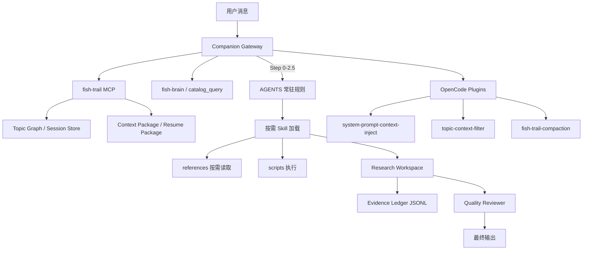
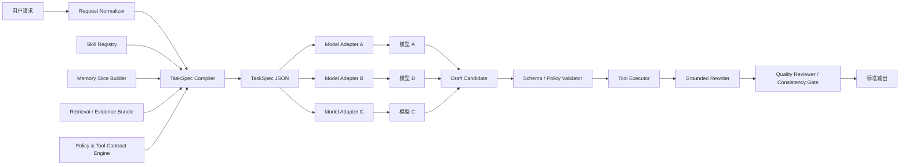
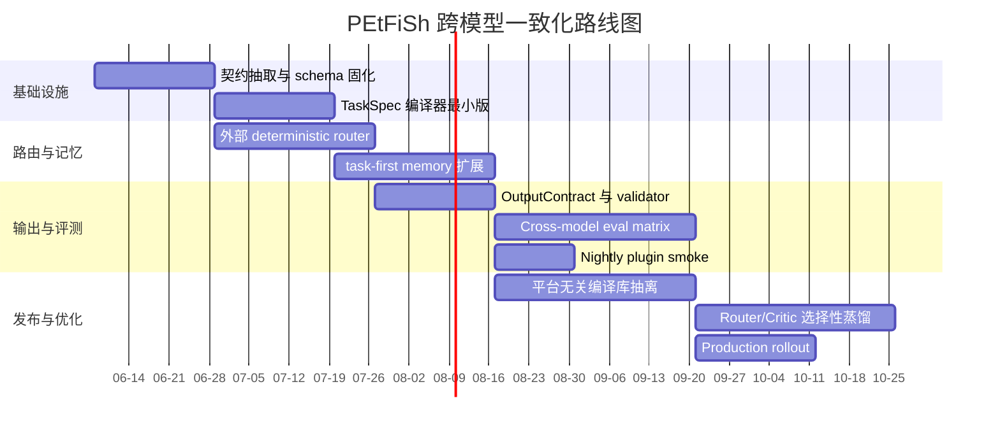

# 如何把 PEtFiSh 工程化为跨模型一致的约束式 AI Agent 系统

## 执行摘要

基于 `petfish.ai` 官网、`docs.petfish.ai` 技术文档和 `kylecui/petfish.ai` 仓库代码/测试/计划文档来看，PEtFiSh 已经不是“单一 prompt 的 Agent”，而是一个分层约束系统：最上层是始终执行的 `AGENTS.md`/Companion Gateway，中层是安装时注入的 pack 规则与按需加载的 skill 模块，下层是 MCP 工具、topic/context memory、插件式 compaction/context filtering，以及研究型工作流中的证据账本与质量审计。这种设计已经显著优于“裸模型 + 长 prompt”，并且在 token 成本与多话题上下文治理上拿到了可量化收益，例如 system-prompt 注入实验相对基线降低了 19.1% 总 token、28.0% 输入 token；topic-aware compaction 在单模型 A/B 中又进一步拿到了 20.3% 总 token 节省且未观察到 recall 质量下降。 citeturn35view0turn36view1turn37view0turn53view0

但如果目标是“通过严格约束，让不同模型在任务行为与输出上更加一致、标准化”，当前 PEtFiSh 还差一个关键台阶：**把分散在 prompt、plugin、skill、MCP、workspace、测试中的约束，编译成一个与模型无关的统一任务契约层**。现在的约束虽然很多，但还不够“单一真相源”：skill 触发仍强依赖自然语言 description；topic 过滤和能力感知大量使用关键词/启发式；tiered memory v2 是可选且 feature-flag 控制；现有 benchmark 以启发式分类回归和单模型实验为主，缺乏跨模型 live regression。结果是：PEtFiSh 已经能把**单模型内行为收紧**，但尚未把**跨模型差异**压缩到可治理范围。 citeturn38view0turn42view0turn22view0turn24view0turn44view1turn53view0

因此，最优工程路线不是立刻做端到端微调，而是先在现有体系之上补出一个**控制平面**：用 TaskSpec/ToolContract/MemorySlice/EvidenceBundle 这样的统一接口，把“要做什么、允许做什么、必须引用什么、可加载哪些历史、最终输出必须长什么样”全部结构化，然后只把“文本生成”委托给不同模型。微调只建议用在窄环节，例如 router/normalizer/calibrator 的蒸馏，而不建议过早做整 Agent 微调，因为 PEtFiSh 的强项本来就是模块化 prompt、工具契约和治理门禁，这些资产天然更适合做可移植的控制层。 citeturn30view0turn35view0turn38view0turn39view0

如果只给出一句结论：**PEtFiSh 现在最该做的，不是再加更多 skill，而是把现有 skill、MCP、RAG/证据、memory、prompt 规则统一编译成“模型无关的任务中间表示”，再用跨模型 benchmark 把一致性变成可回归、可上线、可审计的工程指标。** 这一方向与仓库已经存在的 Quality Gate、Research evidence ledger、Gateway benchmark、A/B harness、MCP call log 机制是天然一致的。 citeturn39view0turn41view0turn24view0turn23view0turn53view0

## 研究范围与当前基线

本报告只基于三类官方材料：仓库公开文件、`petfish.ai` 官网、`docs.petfish.ai` 文档站。仓库本身已包含设计说明、插件实现、MCP 服务器、技能包、tests、benchmarks、research 工作区、docs-site 和 GitHub Actions workflow，因此信息密度已经足以完成一次体系级分析。公开材料同时表明 PEtFiSh 面向 8 个 AI 平台做适配，但公开文档更强调“平台支持”而不是“目标模型矩阵”；也没有给出正式的端到端时延 SLA、团队规模或生产并发预算，因此这些都应被视为**未指定参数**，后续方案需参数化设计。 citeturn8view0turn33view0turn34view0turn36view0turn44view0turn44view3

| 资产层 | 当前仓库/站点里已经存在的内容 | 对“一致化”意味着什么 | 关键证据 |
|---|---|---|---|
| 设计与产品叙事 | 官网明确把 PEtFiSh 定义为“每轮都在”的 Companion，而不是按需调用的工具箱；文档站把系统拆成 Guides、Reference、Developer、Technical 四层 | 一致性目标不是“回答像不像”，而是“交互前置守护 + 过程约束 + 输出治理” | 官网首页与文档首页。 citeturn33view0turn34view0 |
| Prompt 架构 | 技术文档给出 Layered Instruction Injection：平台 system prompt → `AGENTS.md` → pack 注入规则 → skills → commands/agents | 已具备“约束分层”的正确骨架，但尚未统一成模型无关 IR | 技术文档《System Prompt Architecture》。 citeturn35view0turn36view0 |
| 运行时配置 | `opencode.json` 当前启用了 4 个插件、3 个本地 MCP：`context-state`、`skill-registry`、`usage-cost` | 已进入“控制平面 + 运行时插件”阶段，而不只是 prompt engineering | `opencode.json`。 citeturn45view0 |
| MCP / tools | `server.py` 将 fish-trail 暴露为 31 个工具，覆盖 topic lifecycle、detect、context、contamination、decision、session、routing、memory context | 工具接口已很丰富，但更偏“topic governance”而非“统一任务契约” | `packs/core/fish-trail/.../server.py`。 citeturn22view0turn23view3 |
| Skills 与 Pack | Skill Authoring Guide 规定 `SKILL.md`、`references/`、`scripts/`、`schemas/`、`evals/` 结构；`fish-brain` 和 `research-router` 展示了技能级 workflow、边界与输出约束 | 技能模块化已成型，是构建标准化 agent 行为的主要拼装单元 | Skill Authoring、`fish-brain/SKILL.md`、`research-router/SKILL.md`。 citeturn38view0turn54view0turn55view0 |
| History / memory / context | `system-prompt-context-inject.ts`、`topic-context-filter.ts`、`ContextBuilder`、`SessionStore`、`ContaminationScorer`、`get_memory_context` | 已有 topic memory、resume package、缓存稳定块、上下文过滤和污染评分，但 schema 还没有上升为全局统一任务记忆模型 | 插件代码、context/session tests、contamination tests。 citeturn46view0turn47view0turn18view0turn17view0turn17view1turn19view0turn22view0 |
| 评测与运行 | `benchmarks/`、topic-aware compaction A/B harness、CI / eval workflow、docs/website workflow 都已存在 | 已具备“把行为变成可回归资产”的基础，但 live cross-model 覆盖还不足 | `benchmarks/README.md`、`petfish-eval.yml`、`ci.yml`、A/B harness/report。 citeturn24view0turn44view0turn44view1turn53view0turn53view1 |

一个非常值得重视的现象是：官方材料内部已经出现了**口径不一致**。官网首页写的是“四个核心包 + 十个市场包”，而文档首页写的是“13 个 skill packs（4 core + 9 optional）”。这不是小问题，而是一个工程信号：如果连官方目录口径都还会漂移，那么“跨模型一致输出”的上层叙事、一致的包发现逻辑、乃至 benchmark 的覆盖范围都还没有完全被统一的数据源驱动。 citeturn33view0turn34view0

## 现有约束式 Harness 的工程拆解

### Prompt 与模块层

PEtFiSh 当前最强的工程资产，是把“规则”明确分成常驻层与按需层。技术文档说明 `AGENTS.md` 是每轮都加载的 always-on core，里面放 Companion Gateway、跨任务策略、发布纪律等；pack-specific rules 则在安装时注入到 `AGENTS.md`；skills 则作为按需加载的 prompt modules，只在命中时装入上下文。文档还明确指出，skill 的 `description` 是触发匹配的唯一表面，`references/` 按需加载，`scripts/` 运行但不读入上下文，从而减少 token 压力。这个分层思路本身就是“跨模型一致化”的正确起点，因为它把知识、规则、工具和工作流分到了不同的载体上。 citeturn35view0turn36view0turn38view0

但同一套文档也暴露了当前体系的一条硬边界：**skill 是否触发，仍然取决于 description 的自然语言匹配**。Skill Authoring Guide 要求 description ≤500 字、覆盖 body 中 ≥80% 的 trigger words，并且强调“the agent only reads `description` to decide whether to activate a skill”；技术文档同样说 description 是唯一 trigger surface。换句话说，当前 skill 路由的“编译器”仍然是模型自己的语义判断，而不是一个完全独立、确定性的外部控制器。不同模型对关键词、多语混合表述、模糊意图的敏感度不同，这会直接带来 skill 载入差异。 citeturn38view0turn35view0

### Companion Gateway 与前置控制层

官网、AGENTS 以及技术文档都把 Companion Gateway 放在系统最前面：Step 0 Mode Read、Step 1 Topic Check、Step 1.5 Failure Signal、Step 2 Skill Sense、Step 2.5 Anti-Sycophancy、Step 3 Proceed，再在交互后做 topic update。文档特别强调两件事：第一，Gateway 是放在 `AGENTS.md` 顶部的行为指令块，而不是中间件或 API proxy；第二，所有依赖外部组件的步骤都必须 graceful degradation，不能因为 MCP 或脚本不可用就阻塞正常工作。这个设计很适合跨模型，因为它把“必须先做的控制动作”提升到了高优先级指令层。 citeturn37view0turn9view0

`fish-brain/SKILL.md` 与 `catalog_query.py` 则把 Gateway 里与能力感知相关的部分具象化为可审计逻辑：有 Tier 0 failure-signal regex，有 Tier 1 pack/domain trigger map，有 Tier 2 外部能力缺口启发式，还有 session 去重与更新提示。`catalog_query.py` 进一步把 alias、TRIGGERS、FAILURE_SIGNALS、profiles 与 installed registry fallback 代码化。也就是说，PEtFiSh 并不是只在 prompt 里“说应该怎么做”，而是已经把一部分推荐与发现行为下沉成了脚本化控制逻辑。 citeturn54view0turn42view0

### RAG、证据流与研究工作流

PEtFiSh 的“RAG”并不是一个单一向量库检索器，而更接近**文件化、可审计的证据工作流**。Research Workbench 文档把研究任务拆成 router → brief framer → source discovery → literature access → note capture → insight log → evidence ledger → synthesis → report writer → quality reviewer，并规定数据密集环节默认使用 JSONL，面向人类阅读的环节使用 Markdown；workspace 目录则被固定为 `00_brief/`、`01_sources/`、`02_notes/`、`03_evidence/`、`05_analysis/`、`06_outputs/`、`07_reviews/` 等。这个设计的实质，是把“可追溯证据链”做成了 agent 运行现场的一部分。 citeturn41view2turn41view0

更关键的是，Research Workbench 对“事实、推断、冲突、不确定建议”的边界划分非常清楚：`EXTRACTED`、`INFERRED`、`AMBIGUOUS`、`PROPOSED` 四类证据被强制区分；如果 claim 没有合法的 `source_id` 与 `evidence_id`，`research-quality-reviewer` 就会判定为 unsupported claim 而不让报告通过。这等于在研究类任务里已经实现了“输出必须过结构化证据约束”的模式。这套做法不是传统意义上的 RAG pipeline 名字，但它比普通 RAG 更适合做跨模型一致化，因为它把 retrieval 输出变成了可验证工件，而不是临时塞给模型的一段上下文。 citeturn41view0turn41view3

### Tools、MCP 与契约层

`context-state/server.py` 已经暴露出比较成熟的本地 MCP 结构：topic 创建/更新/图谱、topic_detect、context_build/export/freeze、contamination score/explain、decision_log/history、session_bind/get/list/resume/close/timeline/query/agents、topic_route/report/validate，以及 feature-flag 控制下的 `get_memory_context`。工具描述本身已经开始接近一种“行为接口定义”，例如 `topic_route` 明确产生带 `must_load/may_load/must_not_load` 的 active context，`get_memory_context` 明确是 hot/warm/cold 且 budget-aware token allocation。服务端还把 mutation 自动记审计日志，并将每次 MCP 调用记入 `mcp-call-log.jsonl` 以供 benchmark 观察。 citeturn22view0turn23view0turn23view2

更深一层，`dev_reference/Ch05_Skills_能力与契约.md` 已经把“工具契约”理论化了：它要求 description、inputSchema、outputSchema、permissions、sideEffects、errorSemantics、executionBoundary 这些要素齐备；反对只在 prompt 里描述参数约束；反对把后端 API 原样暴露给模型；反对单个 Agent 可见工具过多，并明确指出建议把单 Agent 可见工具量控制在 20 个以内。这篇文档本质上已经给出了 PEtFiSh 下一步实现“跨模型标准化”的语言：不是再堆 prompt，而是把能力边界变成结构化契约。 citeturn30view0

### History、memory 与上下文治理层

PEtFiSh 的 memory 目前以 fish-trail 为中心，是一个**topic-first memory system**。`system-prompt-context-inject.ts` 把 topic state 注入到缓存稳定的 system prompt prefix 中，并实现 disk / realtime 双模式、cache-stable memory blocks、reflective brief compression、自适应压缩状态；`topic-context-filter.ts` 则在真正发请求前按 active topic 过滤消息，并保持“最后 N 条消息保留、tool_use/tool_result 不拆开、单话题不删、短对话不处理”等安全不变量。 citeturn46view0turn47view0

相关测试也揭示了 memory schema 的当前形态。`tests/test_context_builder.py` 证明 Context Package 至少包含 `Topic Info`、`Summary`、`Key Decisions`、`Active Context`、`Related Topics` 等固定 section，并支持 bridge/export/freeze。`tests/test_session_store.py` 表明 resume context 至少有 `session_id`、`inherited_from`、`status`、`active_topic_id`、`topic_refs`、`summary`、`last_activity_at`、`timeline_digest`；其中 `timeline_digest` 是最近 10 条、只保留 `ts/type/topic_id` 的轻量摘要。`tests/test_contamination_scorer.py` 则把污染风险拆为 `topic_distance`、`goal_conflict`、`term_overloading`、`output_format_divergence`、`history_bias` 五个维度。换言之，PEtFiSh 已经有了 memory schema，但它主要服务于**上下文隔离与恢复**，而不是统一的“任务状态机”。 citeturn18view0turn17view0turn17view1turn17view3turn19view0

下面这张图可以概括 PEtFiSh 当前的“多层约束”现状：



这套结构说明 PEtFiSh 已经具备“严格约束 Agent”的框架原型；真正欠缺的是一个把这些约束**统一编译**的中间层。 citeturn37view0turn45view0turn46view0turn47view0turn41view0

## 与跨模型一致化目标的关键差距

### 触发与路由还没有脱离模型语义表面

最核心的差距，是 skill/route/gap-detection 仍然严重依赖自然语言触发表面。Skill 文档明确把 `description` 设为唯一 trigger surface；Gateway benchmark 里的 `gateway-topic-drift`、`skill-sense`、`failure-signal`、`cost-routing` 也主要回归关键词/规则分类器；`topic-context-filter.ts` 仍然是以 topic/domain keywords 做 relevance scoring；`fish-brain` 的 Tier 2 也是启发式判断“是否需要外部服务或专项工具”。这些机制在单模型内足够有用，但在多模型下会因为语义边界不同而产生不同的触发与加载路径。 citeturn38view0turn24view0turn47view0turn54view0

### 约束很多，但没有单一的任务中间表示

当前约束分散在多个载体里：`AGENTS.md` 管“先做什么”，`SKILL.md` 管 workflow 与输出格式，`catalog_query.py` 管领域映射，`server.py` 管工具接口，Research workspace 管证据工件，`SessionStore` 管历史恢复，插件再额外管 compaction/filtering。每一层都合理，但它们之间缺少一个统一的 TaskSpec。结果是，同一任务在不同模型上虽然都“受到约束”，却未必被约束成同一个结构化任务对象。这会让模型在边界场景下用不同方式理解“当前任务到底是什么、允许取哪些历史、允许调用哪些工具、最终必须产出什么结构”。 citeturn35view0turn42view0turn22view0turn41view0turn17view0

### Memory 是 topic-first，而目标需要 task-first + output-first

fish-trail 的强项是 Topic Governance，但“跨模型一致输出”最终考验的是 task execution contract。现有 memory 设计更重视 topic 切换、resume、contamination 和 compaction；`get_memory_context` 也是 hot/warm/cold topic summaries；`reflective_brief` 计划与 injected-block-state 也围绕 topic summary 压缩展开。这对减少污染和节省 token 很有效，但还不足以保证“同一任务在模型 A/B/C 下走同一工具链、产出同一字段集合、引用同一证据粒度”。这需要把 memory 的主键从 topic 扩展到 `task_id / plan_id / evidence_bundle_id / output_contract_id`。 citeturn22view0turn46view0turn26view0

### 评测资产已经存在，但跨模型、活体、端到端回归还不够

仓库里已经有三类评测资产：一类是 benchmarks 中的规则分类回归；一类是 fish-trail 相关单元测试；一类是 topic-aware compaction 的受控 A/B harness。问题在于，它们分别覆盖的是**启发式分类正确性**、**模块单测稳定性**和**单模型 A/B 运行收益**，而不是“同一任务在多个模型、多个温度、多个平台适配器下是否仍输出同一 Task Contract”。研究报告自己也承认 topic-aware compaction 目前只测了单模型 `claude-sonnet-4`、单 session size、未测多用户并发，而且 hook 还是 experimental。 citeturn24view0turn44view1turn53view0

### 平台与运行时差异仍会破坏行为收敛

PEtFiSh 文档一方面强调多平台适配，另一方面若要拿到最强上下文控制效果，又明显依赖 OpenCode 的 plugin hooks。`system-prompt-context-inject.ts` 写明 realtime 模式依赖 OpenCode patch / upstream PR；topic-aware compaction 的研究则依赖 `experimental.session.compacting`；`petfish-eval.yml` 也明确把 plugin-smoke 从 CI 移除，因为需要 OpenCode runtime，本地-only 测试则放在 `tests/plugin/topic-context-filter.test.ts`。这说明当前体系的最强约束能力其实还**没有完全进入 CI 里的统一活体验证闭环**。 citeturn46view0turn53view0turn44view1turn49view0

### 文档与策略内部仍存在“设计张力”

现在的系统架构与未来计划之间还存在设计张力。技术文档当前主张 pack rules 安装时合并进 `AGENTS.md`；但 `tiered-agents-md-plan.md` 又明确指出完整 `AGENTS.md` 约 4,136 tokens，其中只有约 1,348 tokens 是 universally needed，剩余约 2,788 tokens 属于 pack-specific rules，应改成 OpenCode 下的 L1 按需加载。再加上官网与文档首页对 pack 数量口径不一致，这说明 PEtFiSh 已经识别到 prompt 成本与治理复杂度问题，但还没有把所有公开叙事与实现彻底收敛。对于“跨模型一致化”来说，这种张力会直接反映为不同平台、不同安装状态、不同 pack 组合的行为差异。 citeturn27view2turn35view0turn33view0turn34view0

下表把这些差距收束为工程问题：

| 差距 | 当前证据 | 为什么会阻碍一致输出 | 优先级 |
|---|---|---|---|
| 触发面依赖 description/关键词 | Skill docs 与 benchmark 都强调 description/keywords/heuristics。 citeturn38view0turn24view0turn47view0 | 不同模型对触发词、近义表达、多语混合的敏感度不同 | 高 |
| 缺少 TaskSpec 单一真相源 | 约束分散在 AGENTS、SKILL、插件、MCP、workspace。 citeturn35view0turn22view0turn41view0 | 相同任务会被不同模型“重新解释” | 高 |
| Memory topic-first 而非 task-first | fish-trail 更重 topic/session/compaction。 citeturn22view0turn17view0turn46view0 | 只能保证上下文治理，不能保证执行路径一致 | 高 |
| Live cross-model benchmark 不足 | 现有 benchmark 多为规则回归；A/B 仅单模型。 citeturn24view0turn53view0 | 无法证明“跨模型收敛” | 高 |
| 插件活体验证未进入 CI | plugin-smoke 被拿掉，本地-only 测试存在。 citeturn44view1turn49view0 | 最关键的运行时行为不能持续回归 | 中高 |
| 文档/配置口径漂移 | 官网与 docs 包数量不一致；AGENTS 方向存在重构计划。 citeturn33view0turn34view0turn27view2 | 上层约束语义本身还在变化 | 中 |

## 建议架构与接口标准

### 总体方向

建议把 PEtFiSh 从“多层约束的 Agent 框架”推进到“**模型无关控制平面 + 可替换生成平面**”。换句话说，模型不再直接面对原始用户请求、松散的 skill 说明和开放式历史，而是先由一个确定性编译器把一切上下文编译成统一的 TaskSpec；模型只负责在 TaskSpec 允许的轨道内生成 candidate；最后再由 validator、tool executor、quality reviewer 把 candidate 转成可执行、可审计、可回归的标准结果。这个方向与 PEtFiSh 已有的 Tool Contract 思想、Quality Gate、Research evidence ledger、Session/Context package 全都同向。 citeturn30view0turn39view0turn41view0turn17view0



### 建议新增的统一接口

建议新增四个一等公民数据对象，并把它们做成仓库内的公开 schema：

| 对象 | 作用 | 关键字段 | 与现有资产的映射 |
|---|---|---|---|
| `TaskSpec` | 统一描述当前任务 | `intent`、`task_type`、`constraints`、`required_skills`、`allowed_tools`、`output_contract`、`risk_profile` | 汇总 AGENTS、Gateway、SKILL、pack 路由 |
| `EvidenceBundle` | 统一描述可被引用的检索/研究证据 | `source_id`、`evidence_id`、`evidence_type`、`claim`、`authority`、`freshness` | 直接映射 research workspace 的 `01_sources/`、`02_notes/`、`03_evidence/` |
| `MemorySlice` | 统一描述此轮允许加载的历史 | `active_topic_id`、`task_id`、`session_digest`、`must_load`、`may_load`、`must_not_load` | 扩展 fish-trail 的 active context、resume context、topic route |
| `OutputContract` | 统一描述最终输出必须满足的结构 | `schema_id`、`required_sections`、`citation_policy`、`tool_trace_required`、`style_profile` | 汇总 SKILL 输出格式、质量门禁、引用政策 |

这四个对象不应只在文档里存在，而应各自对应 JSON Schema 与版本号，并进入 `schemas/`，使它们能被 Skill、MCP server、CI、benchmark、报告生成器同时消费。这样做的直接好处是：**模型差异被压缩在 adapter 层，而不是散落在整个系统里。** 这一点和开发参考文档里强调的 `inputSchema/outputSchema/permissions/errorSemantics/executionBoundary` 思路完全一致。 citeturn30view0turn38view0turn39view0

一个最小化的 `TaskSpec` 可以先从下面这样的结构开始：

```json
{
  "task_spec_version": "0.1.0",
  "task_id": "tsk_20260601_001",
  "task_type": "research_report",
  "intent": {
    "goal": "分析如何让 agent 在跨模型下行为一致",
    "language": "zh-CN",
    "freshness": "repo_and_site_only"
  },
  "constraints": {
    "must_use_skills": ["research-router"],
    "must_use_memory": true,
    "must_cite_evidence": true,
    "disallow_freeform_claims": true
  },
  "allowed_tools": [
    "topic_route",
    "get_memory_context",
    "research-evidence-ledger"
  ],
  "memory_slice": {
    "mode": "topic+task",
    "must_load": ["active_topic", "recent_decisions"],
    "must_not_load": ["off_topic_clusters"]
  },
  "output_contract": {
    "format": "markdown_report",
    "required_sections": ["executive_summary", "analysis", "roadmap"],
    "citation_policy": "every_claim",
    "style_profile": "rigorous_zh_cn"
  }
}
```

### 对现有层的具体改造建议

第一，**把 skill 激活从“description-only”升级为“两段式路由”**。第一段用外部 deterministic router 产生 `required_skills / optional_skills / forbidden_skills`；第二段再让模型加载对应 skill。也就是说，模型不再自己决定要不要加载 skill，而是消费已编译的 skill set。这样可以保留现有 skill 资产不动，只把触发权从模型收回到控制平面。当前 `catalog_query.py`、`fish-brain`、skill eval、routing-rules 文档都可以直接转换成 router 训练/规则语料。 citeturn42view0turn54view0turn55view0turn38view0

第二，**把 research 工作流升级为全局 EvidenceBundle 规范**。目前 research pack 已经把 source/note/evidence/report/review 分开，并严格区分 `EXTRACTED/INFERRED/AMBIGUOUS/PROPOSED`。建议不要把这套模式限制在 research pack 内，而是把它推广到所有需要 grounding 的任务：架构评审、部署建议、工具推荐、文档生成，都可以要求 candidate output 先引用 `evidence_id`，再生成用户可读文本。这样一来，跨模型差异就不会首先体现在“写法”，而会先体现在“是否选择了同一组证据”；后者更容易测、更容易 gate。 citeturn41view0turn41view2turn41view3

第三，**把 fish-trail 从 topic governance 扩展为 task governance**。现有 `TopicStore / SessionStore / ContextBuilder / ContaminationScorer` 很强，但它们主要回答“当前是不是换话题了”。建议在同一套 store 里新增 `task.json` 或 `task_registry.json`，让 `topic` 管语义域，`task` 管执行单元，`plan` 管步骤，`output_contract` 管交付形状。这样同一 topic 下的不同任务不会互相污染，同一任务跨 topic 取证时也不会丢掉 contract。 citeturn22view0turn18view0turn17view0turn19view0

第四，**把 plugin 的价值收敛为“上下文编译器”，而不是平台特化魔法”**。当前 `system-prompt-context-inject`、`topic-context-filter`、`fish-trail-compaction` 都非常有价值，但它们更像 OpenCode-specific runtime advantage。建议把它们的核心逻辑抽成平台无关库：例如 `compile_memory_slice()`、`compile_context_blocks()`、`compile_compaction_prompt()`，插件只是调用这些纯函数。这样在 OpenCode、Claude、Copilot、Codex 上至少能共享“编译逻辑”，而不是只在某个平台上共享效果。 citeturn46view0turn47view0turn36view0turn53view0

### Prompt-only、微调与混合路线的比较

| 路线 | 做法 | 一致性潜力 | 可移植性 | 工程成本 | 风险 | 结论 |
|---|---|---:|---:|---:|---|---|
| 纯 Prompt 延续 | 保持现有 AGENTS + skills + plugins，只补少量规则 | 中 | 高 | 低 | 仍受模型触发差异影响 | 只能做短期止血 |
| Prompt + Schema + External Router | 新增 TaskSpec/OutputContract/Deterministic Router，但不训练模型 | 高 | 很高 | 中 | 需要整理现有资产为 schema | **最优先** |
| 上述方案 + 窄环节蒸馏 | 对 router / intent-normalizer / calibration classifier 做小模型蒸馏 | 很高 | 高 | 中高 | 需要高质量 trace 语料 | **第二优先** |
| 端到端全 Agent 微调 | 直接对整个 agent 行为做 SFT/RL | 中高 | 低 | 高 | 供应商锁定；与多平台策略冲突 | 不建议先做 |
| 规则完全外置为 workflow engine | 模型只做填槽，几乎不做自主推理 | 很高 | 很高 | 高 | 灵活性下降，维护成本高 | 适合高风险子域，不适合全局 |

我的建议是：**主路径采用“Prompt + Schema + External Router”，仅在 router/normalizer/consistency-critic 上做选择性蒸馏；不建议当前阶段做全 Agent 微调。** 原因很简单：PEtFiSh 已经把能力沉淀在 prompt modules、质量门禁、workspace 结构、MCP 工具与 research pipeline 里，这些都是很强的“控制资产”；如果过早做端到端微调，反而会把这些可审计资产重新压进模型参数，丢掉可移植性与可解释性。 citeturn35view0turn38view0turn39view0turn30view0

## 评测方法与可复现实验

### 应该新增的核心指标

现有 benchmark 很适合做局部 regression，但若目标改成“跨模型一致行为”，建议引入一个统一指标：**OCI，Output Consistency Index**。OCI 不评“哪篇文笔更好”，而评“不同模型是否遵循了同一契约”。一个实用的版本可以由以下维度加权组成：

- `Schema Validity`：输出是否满足 `OutputContract` 和 JSON Schema。
- `Route Agreement`：不同模型是否选择了同一组 `required_skills / tool plan`。
- `Tool Trace Agreement`：工具调用序列在归一化后的一致度。
- `Evidence Fidelity`：claim → `evidence_id` → `source_id` 的完整率。
- `Memory Correctness`：resume/active topic/task 是否正确承接。
- `Safety Consistency`：相同风险输入下是否都触发相同 gate/refusal/escalation。
- `Style Determinism`：在相同 style profile 下，结构顺序与 section 覆盖是否稳定。
- `Cost Stability`：跨模型在相同 TaskSpec 下的 token / latency 方差是否可控。

其中前六项应该高于风格项，因为“契约一致”比“措辞相似”更重要。这个设计与当前 research-quality-reviewer、Quality Gate、gateway eval、MCP call log 思路一致，只是把它们合并成统一的跨模型视角。 citeturn39view0turn41view3turn24view0turn23view0

### 现有 benchmark 能直接复用什么

仓库已经有非常好的 benchmark 骨架。`benchmarks/README.md` 里现成就有 `gateway-topic-drift`、`skill-sense`、`failure-signal`、`cost-routing` 四套数据集与 target accuracy；`petfish-eval.yml` 也已经把这些 benchmark 接进了 GitHub Actions。另一方面，topic-aware compaction 目录里又有完整的 A/B harness、测试协议、预期输出，以及自动化对比 baseline/plugin 的方式。这意味着你不需要从零写 benchmark 平台，只需要把“跨模型一致性”新增为一层测试矩阵。 citeturn24view0turn44view1turn52view0turn52view1turn53view1

### 建议的 benchmark 矩阵

| Benchmark | 当前仓库已有基线 | 新增要测什么 | 主要指标 | 复现方式 |
|---|---|---|---|---|
| Gateway 分类回归 | `gateway-topic-drift`、`skill-sense`、`failure-signal`、`cost-routing`。 citeturn24view0turn44view1 | 改成模型矩阵运行，比较每个模型在同一 TaskSpec 下的 route agreement | Accuracy、macro-F1、route agreement | 直接扩展 `run_eval.py` |
| Skill 触发一致性 | Skill Authoring 已要求 trigger eval。 citeturn38view0 | 同一输入在 3–5 个模型上是否激活同一 skill set | Precision/Recall、pairwise agreement | 新增 live trigger runner |
| 工具调用一致性 | MCP server 有 `mcp-call-log.jsonl`。 citeturn23view0 | 归一化工具序列是否一致；副作用工具是否遵守相同边界 | Tool-plan F1、unsafe divergence rate | 解析 call log + golden trace |
| Memory / Resume 正确性 | `SessionStore`、`ContextBuilder` tests 已有。 citeturn18view0turn17view0 | 多模型 resume 同一 session 后是否加载相同 `MemorySlice` | Resume accuracy、topic/task carryover error | 固定 workspace snapshot |
| 研究型 grounding | Research pack 的证据账本与 reviewer 已有。 citeturn41view0turn41view3 | 不同模型生成的报告是否引用相同 bundle、是否保持 claim trace 完整 | Unsupported-claim rate、citation lineage completeness | 固定 `01_sources/02_notes/03_evidence` |
| 上下文治理与 compaction | topic-aware compaction A/B 已有。 citeturn53view0turn52view1 | 把单模型 A/B 扩成跨模型 A/B/ABn；再测 task-first memory 后的收益 | OCI、token delta、wall-time delta | 双目录/多目录 server harness |
| 运行时插件行为 | 本地有 `topic-context-filter.test.ts`，CI 暂无 plugin smoke。 citeturn49view0turn44view1 | plugin 编译逻辑是否在真实 runtime 上持续稳定 | Smoke pass rate、platform parity | 把 OpenCode runtime 纳入 nightly job |

### 推荐的实验设计

建议按“三层实验”推进。第一层是**离线编译实验**：验证 Request Normalizer + TaskSpec Compiler 在不调用模型时，是否能把输入统一编译成稳定的 `TaskSpec`。第二层是**在线受控实验**：固定同一 `TaskSpec`、同一工具 mock、同一 `EvidenceBundle` 和同一 `MemorySlice`，分别在不同模型上生成草稿，再看 OCI。第三层是**真实工作流 A/B 实验**：沿用 topic-aware compaction 的 harness 思路，把 baseline 设为“当前 PEtFiSh”，treatment 设为“TaskSpec 编译版 PEtFiSh”，比较 token、latency、OCI 与人工评分。这里最重要的是**固定非模型变量**，否则你测到的是检索噪声、历史噪声或工具响应噪声，而不是模型差异。 citeturn52view1turn53view1turn53view0

## 迁移、运行与治理

### 先利用现有 CI/CD，而不是另起炉灶

PEtFiSh 当前已经有四条重要流水线：`ci.yml` 跑单元测试、pack manifest、install scripts、research smoke 和 trigger eval；`petfish-eval.yml` 跑 fish-trail tests 与 benchmark datasets；`docs.yml` 生成并部署 docs-site；`website.yml` 把官网静态资源部署到服务器。这说明项目已经有“代码—文档—评测—官网”四位一体的发布思路。下一步的最佳做法不是再搭一套独立体系，而是把 TaskSpec、cross-model eval、plugin smoke、golden traces、consistency gate 逐步并入现有 workflow。 citeturn44view0turn44view1turn44view2turn44view3

### 监控应该从“是否成功”升级为“是否收敛”

`server.py` 里已经把 MCP 调用记录到了 `mcp-call-log.jsonl`，这很好，因为它天然可以成为 consistency telemetry 的源头。建议把监控指标扩大到四类：其一，**编译层指标**，例如 TaskSpec 命中率、schema 版本漂移、memory_slice 大小；其二，**执行层指标**，例如工具序列偏差、MCP 调用失败分布、P95 tool latency；其三，**输出层指标**，例如 schema validity、unsupported-claim rate、citation lineage completeness、reviewer reject rate；其四，**模型层指标**，例如 pairwise OCI、跨模型 cost variance、route disagreement hotspots。把这些都写入统一的 JSONL/Parquet 轨迹后，才真正能做到“发现某个模型最近开始偏离”。 citeturn23view0turn39view0turn41view3

### 安全与治理已经有基础，但要前移到控制平面

PEtFiSh 现有的安全/治理基础并不弱：Quality Gate 要求 lint ≥80、audit ≤0.5 且无 CRITICAL 才 PASS；官网首页强调 TrustSkills 六维风险评估、四条红线硬拒绝；开发参考又强调 tool contract 的 permissions、sideEffects、errorSemantics 和 executionBoundary。这些机制如果继续只停留在“发布 skill 前检查”，还不能完全解决跨模型执行差异。建议把它们前移到在线控制平面：**模型每次生成 tool call plan 前，先吃到 ToolContract；生成后再经 contract validator 过滤；高危 sideEffects 一律 require human-confirmed transition。** 这样不同模型即使产生不同草稿，也会被同一套边界收敛。 citeturn39view0turn33view0turn30view0

### 优先级路线图

下面给出一条务实的落地路线。工时是基于当前仓库已具备大量现成资产而估算的；由于公开材料没有给出团队规模，这里按“2–4 名工程师 + 1 名评测/产品协作”做粗估，若团队更小需要顺延。

| 优先级 | 阶段 | 目标 | 预计工作量 | 主要风险 | 成功标志 |
|---|---|---|---:|---|---|
| P0 | 契约抽取 | 从 AGENTS、SKILL、MCP、research workspace 中抽取统一 schema：`TaskSpec / EvidenceBundle / MemorySlice / OutputContract` | 2–3 周 | 现有规则分散、命名不一致 | schema 版本落地，能覆盖 80% 高频任务 |
| P1 | 外部路由器 | 将 skill 触发与 route 从 model 内部迁到 deterministic router | 2–4 周 | 旧 skill description 与新 router 规则冲突 | 同一输入跨模型的 required_skills 一致率显著提升 |
| P1 | Memory 升级 | 在 fish-trail 上新增 task-first 主键与 task resume | 3–4 周 | topic/task 双主键设计复杂 | multi-step 任务 resume 不再只靠 topic |
| P2 | 输出契约化 | 为高价值任务建立 OutputContract 与 schema validator | 2–3 周 | 现有 skills 输出风格差异大 | schema validity ≥95% |
| P2 | Cross-model eval | 扩 benchmark 与 A/B harness 为模型矩阵 | 3–5 周 | 成本上升；测试噪声控制难 | OCI 成为 PR/Release gate |
| P3 | 插件与平台收敛 | 抽出平台无关编译库，减少 OpenCode-only 逻辑 | 4–6 周 | 不同平台 hook 能力不对齐 | 关键编译逻辑跨平台复用 |
| P3 | 选择性蒸馏 | 对 router/critic/normalizer 做小模型蒸馏 | 3–6 周 | trace 质量不足 | 在成本下降前提下保持 OCI |



## 开放问题与限制

当前公开材料已经足以支持架构判断，但有几类参数仍未明确，因此必须在实施前补齐。第一，公开材料写清了支持平台，却没有给出正式的**目标模型矩阵**；如果目标只是 OpenCode/Claude/Copilot 三类，设计可更务实，如果还要覆盖更多模型供应商，adapter 与 eval 成本会显著上升。第二，topic-aware compaction 的已公开收益目前来自**单模型、单 session 尺度**实验，不能直接外推到所有模型与所有上下文窗口。第三，公开材料没有给出**延迟预算、成本上限、并发规模、团队规模**；这会影响你是优先做 deterministic router，还是允许更重的 compile-time 检索与 validator 链。第四，官方网站与文档站已有轻微口径漂移，说明在推进一致化工程前，最好先把配置、docs、pack catalog 的单一数据源建立起来。 citeturn33view0turn34view0turn53view0turn44view0turn36view0

结论上，PEtFiSh 已经拥有罕见完整的“约束式 Agent”雏形：always-on gateway、可安装规则层、技能模块、MCP 工具、topic memory、research evidence ledger、quality gate、benchmarks 和 A/B harness，远比多数项目成熟。真正阻碍跨模型一致性的，不是“约束不够多”，而是**约束还没有被统一成一个外部、确定性、可版本化的控制平面**。只要把现有资产收敛为 TaskSpec + ToolContract + EvidenceBundle + MemorySlice，再用 OCI 和 live cross-model benchmark 把它们接进 CI/CD，PEtFiSh 就有很大机会从“一个强 Prompt/Skill 系统”升级成“一个跨模型可移植、可审计、可标准化的 Agent Operating Layer”。 citeturn35view0turn37view0turn41view0turn39view0turn24view0turn53view0