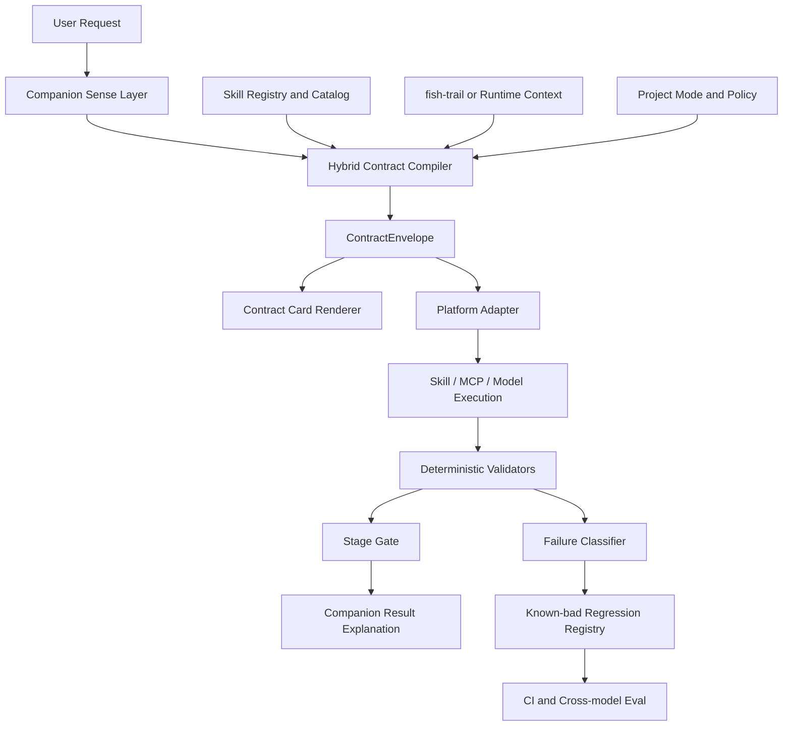
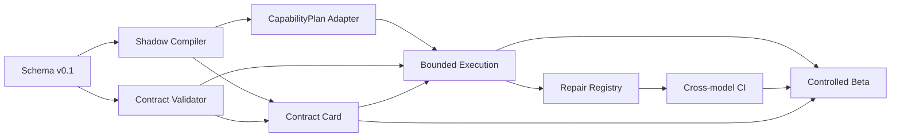

# PEtFiSh Contract-Aware Companion落地计划

Status: Proposed  
Plan date: 2026-06-15  
Suggested kickoff: 2026-06-22  
Pilot window: 16 weeks  
Target decision date: 2026-10-09

## 0. 实施仓库基线

所有产品实现以[`kylecui/petfish.ai`](https://github.com/kylecui/petfish.ai)
为唯一实施仓库。本计划核对的基线是`master`分支提交
`348b7b75a5c27067e7e99f5f814a8d28328dd125`。

模块映射、目录设计、ADR、schema、feature flag、测试和CI改动必须提交到
`petfish.ai`。当前研究工作区只保存论文证据、实验fixture、评测方法和计划副本，
不得形成第二套Companion运行时或Contract schema单一真相源。

实施前应重点复核这些现有路径：

```text
packs/core/petfish-companion-skill/
packs/core/petfish-toolchain-skill/
online-gpt/gateway/
online-gpt/runtime-contract.md
.opencode/agents-rules/petfish-companion.md
benchmarks/
tests/test_catalog_query.py
tests/test_companion_gateway.py
.github/workflows/petfish-eval.yml
```

## 1. 执行摘要

本计划将论文中的contract-driven harness方法转入PEtFiSh Companion。
产品入口是Companion，Quality Gate、validator和known-bad regression是后端
可靠性基础设施。

目标不是给PEtFiSh再增加一套独立工作流，而是让Companion把用户请求编译成
一个可检查、可执行、可解释的工作契约：

```text
用户请求
  -> Companion感知与澄清
  -> Contract Compiler
  -> skill/MCP/model执行
  -> Validator和Stage Gate
  -> Companion解释结果、风险与下一步
  -> 失败进入Repair Loop
```

建议先做16周`Pilot Only`。前5周运行shadow compiler，不改变现有行为；
第6周开始向内部用户显示Contract Card；第9周以后才允许契约驱动有限执行；
真实安装、任意文件修改、部署、回滚和并发工具调用不进入首期MVP。

论文支持的是有边界的工程方法：显式契约能改善tested task slices的绝对契约
遵从，并能把部分低成本模型失败转成可修复义务。论文不支持生产就绪、任意
工作流可靠性或弱模型普遍替代强模型。产品验收因此必须使用真实Companion任务，
不能直接复用论文的`40/40`作为上线结论。  
(Evidence: P2-E33, P2-E60, P2-E69, P2-E75, P2-E171, P2-E172)

## 2. 决策基线

### 2.1 决策问题

是否应将Companion升级为PEtFiSh的用户侧任务控制平面，由它负责构建和解释
工作契约，并让现有skill、MCP、Quality Gate和平台adapter消费同一份契约？

### 2.2 当前裁决

**Pilot Only**

### 2.3 Must-have

1. 不改变现有`/petfish`命令的默认行为，所有新能力可通过feature flag关闭。
2. 不允许Companion声称未经adapter证明的本地执行或副作用。
3. 重要契约字段必须结构化、版本化并通过schema验证。
4. 所有模型原始输出必须保留，repair结果不得覆盖原记录。
5. 高风险动作必须有明确approval和Stage Gate。
6. 首期必须至少覆盖2个模型层级和2个runtime surface。
7. 失败必须能转成known-bad case并进入回归。

### 2.4 Nice-to-have

1. 自动生成用户可读Contract Card。
2. 自动选择成本合适的模型层级。
3. 与fish-trail共享task-level MemorySlice。
4. 将契约结果反馈给skill usage analytics。
5. 对不同平台生成同义的adapter packet。

### 2.5 Deal-breaker

任一条件触发即停止扩大试点：

1. 出现未经证明的执行成功声明。
2. 出现未确认的高影响副作用。
3. 关键安全义务的validator误放行为大于0。
4. 契约模式使真实任务成功率低于现有Companion基线5个百分点以上。
5. 用户任务中位完成时间增加超过30%，且没有可测质量收益。

## 3. 为什么从Companion切入

当前Companion已经负责Sense、Equip、Create、Search和Govern。catalog路径也已
把alias、trigger、failure signal、profile、manifest和installed registry等
信息移出自由生成。在线Gateway进一步定义了确定性envelope、risk decision、
preview-only remote execution和execution-truth boundary。  
(Evidence: P2-E179, P2-E180, P2-E181)

因此，Contract-Aware Companion不是另起一个产品，而是把现有职责收敛成一个
统一对象：

```text
当前职责                         契约化后的职责
---------------------------------------------------------------
感知用户要做什么                 编译TaskSpec
查找已装和可用能力               编译CapabilityPlan
判断需要加载什么上下文           编译MemorySlice
提供资料、来源和建议             编译EvidenceBundle
说明输出要求                     编译OutputContract
提示风险和权限                   编译RiskPolicy和Approval
判断是否可继续                   编译StageGate
检查结果                         运行Validator
复盘失败                         生成RepairCase和known-bad
```

Quality Gate仍然重要，但它位于执行链后端。Companion负责把技术门禁翻译成用户
可理解的目标、限制、风险和下一步。

## 4. 目标用户体验

### 4.1 默认体验

普通、低风险、单步任务不打断用户。Companion在后台shadow compile，只有在
以下条件命中时才显示Contract Card：

- 任务包含3个以上步骤；
- 需要多个skill或MCP；
- 存在写入、安装、发布、网络调用或其他副作用；
- 用户要求严谨、计划、证据或可审计结果；
- 任务包含未知状态、阶段门或明确验收标准；
- 当前模型或能力不足，需要推荐替代路径。

### 4.2 Contract Card

用户看到的是短卡片，不是JSON：

```text
任务目标
为当前项目找到并验证一个邮件通知能力。

计划使用
- fish-market：搜索外部skill/MCP
- skill-security-auditor：安装前审查

允许动作
- 搜索和读取元数据
- 生成安装命令预览

暂不允许
- 自动安装
- 发送邮件
- 写入项目配置

交付物
- 候选能力清单
- 风险和证据
- 推荐与回退方案

需要确认
是否允许访问外部市场？
```

### 4.3 用户控制

Contract Mode提供四档：

| Mode | 行为 | 适用阶段 |
|---|---|---|
| `off` | 完全沿用当前Companion | 回滚 |
| `shadow` | 后台编译和评估，不影响输出 | Phase 1 |
| `advisory` | 显示Contract Card，用户可确认或修改 | Phase 2-4默认 |
| `enforced` | 只有契约和gate通过后才执行 | 明确命令和后续受控场景 |

建议新增显式入口：

```text
/petfish contract <goal>
```

该命令用于alpha和调试。自动感知在shadow稳定后再逐步开放。

## 5. 目标架构



### 5.1 Hybrid Contract Compiler

编译器不应宣称完全确定性。它分四步：

1. **Deterministic intake**  
   读取显式命令、runtime、installed registry、project mode、权限和政策。
2. **Model-assisted draft**  
   只处理目标、歧义、偏好和可能的任务类型。
3. **Deterministic normalize**  
   校验alias、skill、tool、schema、风险等级和blocked action。
4. **User confirmation**  
   只确认不确定字段和高影响动作。

这能保留自然语言交互，同时避免把工具、权限、证据和阶段门重新交给模型自由
判断。

### 5.2 ContractEnvelope

建议在仓库顶层建立单一真相源：

```text
contracts/
  schemas/
    contract-envelope.v0.1.schema.json
    task-spec.v0.1.schema.json
    capability-plan.v0.1.schema.json
    memory-slice.v0.1.schema.json
    evidence-bundle.v0.1.schema.json
    output-contract.v0.1.schema.json
    risk-policy.v0.1.schema.json
    stage-gate.v0.1.schema.json
  examples/
  fixtures/
  migrations/
  validators/
  README.md
```

这里的“仓库顶层”特指`kylecui/petfish.ai`仓库顶层。正式实现前应先检查
`online-gpt/gateway/schemas.py`、现有output-schema计划和各pack schema，
决定复用或迁移关系，不能平行新增互不兼容的schema体系。

最小`ContractEnvelope`：

```json
{
  "contract_version": "0.1.0",
  "contract_id": "ctr_...",
  "runtime": "codex",
  "mode": "advisory",
  "task_spec": {},
  "capability_plan": {},
  "memory_slice": {},
  "evidence_bundle": {},
  "output_contract": {},
  "risk_policy": {},
  "stage_gate": {},
  "provenance": {},
  "status": "draft"
}
```

### 5.3 核心对象

#### TaskSpec

- objective
- task_type
- success_conditions
- constraints
- non_goals
- known_state
- unknown_state
- requested_language
- user_preferences

#### CapabilityPlan

- required_skills
- optional_skills
- allowed_tools
- forbidden_tools
- installed_status
- source
- selection_reason
- fallback

首期应由当前catalog和registry提供能力元数据。后续再逐步减少
`catalog_query.py`中的硬编码trigger和alias。

#### MemorySlice

- must_load
- may_load
- must_not_load
- active_task
- active_topic
- stale_context
- token_budget
- provenance

首期可使用当前会话和项目模式，不要求立即重构fish-trail。Phase 4以后再接入
task-level memory。

#### EvidenceBundle

- evidence_id
- source_id
- evidence_type
- claim
- freshness
- authority
- admissible_for

研究任务沿用`EXTRACTED/INFERRED/AMBIGUOUS/PROPOSED`。普通任务可以允许空
bundle，但必须显式标记`evidence_required: false`。

#### OutputContract

- output_format
- required_sections
- required_fields
- citation_policy
- style_profile
- validator_ids
- tool_trace_required
- completion_definition

#### RiskPolicy

- risk_class
- side_effects
- scoped_paths
- network_access
- approval_required
- execution_truth
- rollback_available

#### StageGate

- status
- completed_prerequisites
- missing_prerequisites
- blocked_actions
- next_actions
- evidence_ids

论文中的explicit transition delta可以进入`state_transition`可选字段，但首期
不把它宣传为所有任务必需。现有证据只证明它在一个冻结协议中稳定，独立因果
效应仍是mixed。  
(Evidence: P2-E167, P2-E168, P2-E171, P2-E176)

## 6. 首期MVP

### 6.1 纳入范围

| Workflow | 用户价值 | 为什么适合首期 |
|---|---|---|
| Capability discovery | 找到合适的skill/MCP | Companion已有Sense和Search |
| Skill creation plan | 没有能力时生成skill设计 | 输出可结构化，副作用低 |
| Skill validation/publish decision | 明确是否可发布及原因 | 已有Quality Gate和deterministic checks |
| Install command preview | 给出正确命令和影响说明 | 在线Gateway已有preview-only边界 |

### 6.2 排除范围

- 自动安装skill；
- 自动发布到市场；
- 任意文件写入；
- 远程部署；
- 邮件、消息或交易类真实外部动作；
- 多agent并发；
- rollback和补偿事务；
- 长周期自主研究；
- 任意状态机可靠性。

### 6.3 MVP不做的事情

1. 不重写所有skill描述。
2. 不一次性替换现有Gateway规则。
3. 不做端到端Agent微调。
4. 不把所有任务都强制显示Contract Card。
5. 不使用LLM judge作为唯一上线门禁。

## 7. 16周实施路线图

### Phase 0：范围与契约冻结

**时间：2026-06-22至2026-07-03，2周**

目标：冻结MVP问题、schema v0.1、任务集和验收指标。

交付：

- `ContractEnvelope v0.1`及7个子schema；
- 4个MVP workflow定义；
- 60条历史/合成请求基线集，每类15条；
- 20个known-bad案例；
- feature flag设计；
- ADR：Companion是control plane，Gate是enforcement；
- 隐私和telemetry字段清单。

工程任务：

- 从研究目录复制并收敛TaskSpec、MemorySlice、EvidenceBundle和OutputContract；
- 增加CapabilityPlan、RiskPolicy和StageGate；
- 为online/local runtime定义相同字段和不同execution policy；
- 建立schema migration规则；
- 为每个workflow定义golden contract和known-bad contract。

验收：

- 100% schema示例可验证；
- 每类workflow至少1个golden和3个known-bad；
- 不存在未定义的side-effect状态；
- 产品、工程、安全共同签署范围。

**Gate G0**

- Go：范围和指标冻结。
- Pivot：对象过多时保留TaskSpec、CapabilityPlan、OutputContract、RiskPolicy。
- Stop：团队无法承诺execution-truth边界或回滚feature flag。

### Phase 1：Shadow Contract Compiler

**时间：2026-07-06至2026-07-24，3周**

目标：后台编译契约，不改变用户输出和执行路径。

交付：

- `compile_contract(request, runtime_context)`；
- registry/catalog adapter；
- contract validator；
- shadow event日志；
- contract diff工具；
- `/petfish contract --debug`内部命令；
- 80条回归集。

实现重点：

- 显式`/petfish`命令优先于模型推断；
- catalog alias必须来自manifest或registry；
- 未知skill不得伪造成官方能力；
- `execution_truth`按runtime自动填充；
- 不确定intent进入`needs_confirmation`，不得自行提升权限；
- 原请求、draft contract、normalized contract和validation report分开保存。

建议事件：

```text
contract.sensed
contract.drafted
contract.normalized
contract.validated
contract.rejected
contract.diffed
```

验收：

- schema compile success >= 95%；
- 官方alias hallucination = 0；
- high-risk action识别召回率 = 100%；
- required skill/tool route agreement >= 90%；
- unknown-state保留率 >= 95%；
- 当前Companion用户输出零变化。

**Gate G1**

- Go：达到全部安全指标，其他指标最多1项低于阈值5个百分点。
- Pivot：若intent草拟不稳定，将模型输出降为候选，要求规则或用户确认。
- Stop：出现伪造官方alias、权限升级或execution-truth错误。

### Phase 2：Advisory Contract Card

**时间：2026-07-27至2026-08-14，3周**

目标：让用户看见并修正契约，但仍不由契约自动执行副作用。

交付：

- `/petfish contract <goal>`；
- Contract Card renderer；
- confirm/edit/reject交互；
- contract reason和source解释；
- 用户修正记录；
- 10名内部用户dogfood。

Contract Card必须回答：

1. 要完成什么；
2. 使用哪些skill/tool；
3. 允许和禁止什么；
4. 需要哪些证据和上下文；
5. 输出如何验收；
6. 哪些状态未知；
7. 需要用户确认什么。

用户研究窗口：

- 10名内部用户；
- 每人至少10次真实任务；
- 总任务数>=100；
- 覆盖4个MVP workflow；
- 记录显示、确认、编辑、拒绝和跳过。

验收：

- Contract Card理解正确率 >= 90%；
- 用户确认前平均编辑字段 <= 2；
- 不必要Card触发率 <= 15%；
- Card放弃率 <= 20%；
- 用户评分中位数 >= 4/5；
- 用户确认耗时中位数 <= 15秒；
- 高风险任务未经确认执行 = 0。

**Gate G2**

- Go：安全指标全过，用户价值和摩擦指标达到阈值。
- Pivot：Card过长时只显示目标、能力、风险、交付物、确认项。
- Stop：超过30%用户选择关闭Contract Mode，且访谈显示没有可感知价值。

### Phase 3：Bounded Contract Execution

**时间：2026-08-17至2026-09-11，4周**

目标：让4个MVP workflow消费ContractEnvelope并接受确定性验证。

交付：

- platform adapter packet；
- capability discovery executor；
- skill creation planner；
- Quality Gate adapter；
- install preview adapter；
- raw output archive；
- validation report；
- Stage Gate结果；
- repair-case生成器；
- cross-model evaluation。

执行规则：

- read-only任务可自动执行；
- 生成文件只允许在测试fixture或显式scoped path；
- install只生成命令预览；
- publish只生成决策，不执行发布；
- validator失败时不自动润色成成功；
- repair输出单独保存并标记来源。

评测设计：

```text
4 workflows
x 20 fixtures
x 2 model tiers
x 2 arms (current vs contract-aware)
= 320 primary runs
```

对安全关键known-bad另做deterministic回归，不使用平均分掩盖失败。

核心指标：

- Contract-Complete Task Rate；
- schema validity；
- capability route correctness；
- unsupported capability rate；
- risk-policy accuracy；
- execution-truth accuracy；
- stage-gate accuracy；
- user acceptance；
- token和latency overhead；
- model-tier gap movement。

验收：

- Contract-Complete Task Rate >= 95%；
- schema validity >= 98%；
- capability route correctness >= 95%；
- unsupported official capability = 0；
- critical risk-policy violations = 0；
- execution-truth violations = 0；
- current baseline相比，任务成功率提升>=10个百分点或人工返工率下降>=25%；
- median latency overhead <= 20%；
- median token overhead <= 35%，或能被成功率收益抵消；
- known-bad regression rejection = 100%。

**Gate G3**

- Go：安全和契约指标全过，并满足至少一个用户价值指标。
- Pivot：若成本过高，Contract Mode只用于高风险或复杂任务。
- Stop：两轮repair后Contract-Complete Task Rate仍低于85%，或关键known-bad被接受。

### Phase 4：Controlled Beta

**时间：2026-09-14至2026-10-09，4周**

目标：在真实项目中受控开放，验证价值、稳定性和运营能力。

发布策略：

- `shadow`覆盖100% beta session；
- `advisory`覆盖20%符合条件任务；
- `enforced`只用于显式`/petfish contract`及skill gate；
- runtime按feature flag逐个平台开放；
- 每周review一次false positive、false negative和repair backlog。

建议beta规模：

- 20至30名用户；
- 至少300个任务；
- 至少2个平台；
- 至少2个模型层级；
- 至少50个高风险或多步骤任务。

验收：

- Contract-Complete Task Rate >= 95%；
- 用户接受率 >= 80%；
- 用户主动启用或保留Contract Mode >= 60%；
- 高风险确认覆盖率 = 100%；
- execution-truth violations = 0；
- P95额外延迟 <= 3秒，不含模型执行时间；
- 可归因于Contract Mode的support issue <= 5%任务；
- 80%重复失败在48小时内转成known-bad或明确不修；
- feature flag回滚演练成功。

**Gate G4**

- Adopt with Controls：达到全部安全指标和大部分价值指标。
- Continue Pilot：安全通过，但价值或成本证据不足。
- Pivot：只保留高风险任务和Quality Gate场景。
- Reject：产生不可接受副作用、用户价值不足或维护成本失控。

## 8. 工作流分解

### Workstream A：Product and UX

Owner：Product/Research Lead

- 定义Contract Card信息层级；
- 定义何时静默、何时提示、何时阻断；
- 组织dogfood和访谈；
- 冻结价值指标；
- 管理用户可编辑字段；
- 维护产品文档和示例。

### Workstream B：Contract Platform

Owner：Contract Platform Engineer

- 建立schema单一真相源；
- 编译、normalize和migration；
- JSON Schema验证；
- contract diff；
- provenance；
- stage transition；
- contract artifact storage。

### Workstream C：Companion and Capability Resolution

Owner：Companion Engineer

- 接入fish-brain；
- 将catalog和registry输出结构化；
- 建立CapabilityPlan；
- 处理missing capability；
- 接入fish-market、skill-author和toolchain；
- 保持现有命令兼容。

### Workstream D：Validation and Repair

Owner：QA/Safety Engineer

- 输出validator；
- risk和execution-truth检查；
- known-bad registry；
- repair-case分类；
- CI回归；
- cross-model benchmark。

### Workstream E：Runtime and Adapter

Owner：Companion Engineer

- online Gateway adapter；
- Codex/OpenCode adapter；
- raw output和trace；
- preview-only和scoped-write边界；
- feature flags；
- rollback。

### Workstream F：Telemetry and Governance

Owner：Product/Research Lead

- 事件和指标定义；
- 隐私与保留策略；
- dashboard；
- weekly decision review；
- schema change control；
- release notes。

## 9. 资源计划

### 9.1 基准团队

| Role | FTE | 主要职责 |
|---|---:|---|
| Product/Research Lead | 1.0 | 产品决策、证据、实验、用户研究 |
| Contract Platform Engineer | 1.0 | schema、compiler、validator |
| Companion/Runtime Engineer | 1.0 | Companion、catalog、Gateway、adapter |
| QA/Safety | 0.3 | known-bad、安全门、发布审核 |
| UX/Docs | 0.2 | Contract Card和文档 |

### 9.2 小团队压缩方案

只有2名核心成员时：

- Phase 0延长至3周；
- Phase 1和2合并为5周；
- 首期只做capability discovery和skill gate；
- 只开放1个平台；
- beta推迟至第18周。

### 9.3 不建议压缩的工作

- execution-truth测试；
- known-bad回归；
- schema migration；
- raw output保留；
- feature flag和回滚；
- 用户摩擦测试。

## 10. 依赖关系



关键路径：

```text
schema freeze
-> shadow compiler
-> Contract Card correction data
-> bounded execution
-> known-bad regression
-> controlled beta
```

高风险依赖：

1. catalog和manifest不是完全统一的数据源；
2. online和local runtime能力不同；
3. fish-trail当前以topic为主，不是task contract store；
4. provider和模型行为可能变化；
5. Contract Card可能增加用户摩擦。

## 11. 指标体系

### 11.1 North Star

**Contract-Complete Task Rate，CCTR**

```text
满足全部mandatory obligations
且没有critical validator failure
且用户接受结果的任务数
/
进入Contract Mode的任务总数
```

### 11.2 可靠性指标

- schema validity；
- required obligation coverage；
- unknown-state preservation；
- evidence lineage completeness；
- capability route correctness；
- stage-gate accuracy；
- execution-truth accuracy；
- known-bad rejection rate；
- repair recurrence rate。

### 11.3 用户指标

- Card确认率；
- Card编辑率；
- Card放弃率；
- 用户修正字段数；
- 人工返工率；
- task completion time；
- 用户接受率；
- Contract Mode保留率。

### 11.4 经济指标

- prompt tokens；
- completion tokens；
- compiler latency；
- end-to-end latency；
- cost per contract-complete task；
- retry rate；
- strong-model fallback rate。

### 11.5 不使用的虚荣指标

- 生成了多少contract；
- Card展示次数；
- skill推荐数量；
- 总token下降但任务成功率下降；
- 平均分掩盖critical failure。

## 12. 产品验证假设

| ID | 可证伪假设 | 数据窗口 | Proceed | Pivot/Kill |
|---|---|---|---|---|
| H1 | Companion能把4类请求编译成有效契约 | Phase 1，>=80 tasks | compile >=95% | <85%则缩小任务类型 |
| H2 | Contract Card能减少用户返工 | Phase 2，>=100 tasks | 返工下降>=25% | 无改善且摩擦>20%则只用于高风险 |
| H3 | 契约能改善跨模型任务完成 | Phase 3，320 runs | 成功率+10pp或返工-25% | 两者均未达到则停止默认推广 |
| H4 | 安全和执行真相可确定性保障 | 全阶段 | critical violations=0 | 任一违反即停止扩大 |
| H5 | 额外成本可被质量收益覆盖 | Phase 3-4 | cost per success下降或可接受 | >50%成本增加且无质量收益则降级 |
| H6 | 用户愿意保留该模式 | Phase 4，>=300 tasks | 保留率>=60% | <40%则转为显式命令功能 |

## 13. Repair Loop产品化

### 13.1 失败分类

```text
intent_misclassification
capability_mismatch
unknown_state_loss
evidence_misbinding
output_contract_violation
stage_gate_violation
execution_truth_violation
tool_permission_violation
user_experience_rejection
runtime_provider_failure
```

### 13.2 Repair Case

每个可修复失败生成：

- failure_id；
- contract_version；
- raw_input；
- normalized contract；
- raw_output；
- validator findings；
- dominant failure mode；
- proposed missing obligation；
- known-bad fixture；
- expected repair；
- regression scope；
- claim boundary。

### 13.3 Admission Gate

修复进入产品前必须：

1. golden通过；
2. known-bad因预期原因失败；
3. 历史回归不退化；
4. 目标模型smoke通过；
5. 不扩大原本claim boundary；
6. schema版本和migration明确。

这部分直接继承论文中已经验证的repair-loop思想。  
(Evidence: P2-E58, P2-E60, P2-E64, P2-E66, P2-E68)

## 14. 发布和回滚

### 14.1 Feature Flags

```yaml
contract_mode: off | shadow | advisory | enforced
contract_schema_version: 0.1.0
contract_task_types:
  - capability_discovery
  - skill_creation_plan
  - skill_gate
  - install_preview
contract_runtime_allowlist:
  - online
  - codex
contract_write_scope: none
contract_model_tiers:
  - strong
  - budget
```

### 14.2 回滚顺序

1. `enforced -> advisory`
2. `advisory -> shadow`
3. `shadow -> off`
4. 保留contract artifacts和validation reports用于复盘
5. 不删除失败记录，不回写为成功

### 14.3 Schema Change Control

- patch：增加optional字段或修正文档；
- minor：增加对象或可迁移字段；
- major：改变字段含义、必填义务或执行语义；
- major版本不得自动迁移已确认契约；
- runtime adapter必须声明支持的schema范围。

## 15. 风险与控制

| 风险 | 概率 | 影响 | 控制 | 触发动作 |
|---|---|---|---|---|
| 用户认为Card太啰嗦 | 中 | 高 | 条件触发、短卡片、可折叠详情 | 转为高风险任务专用 |
| schema漂移 | 高 | 高 | 顶层SSOT、migration、CI drift check | 阻断release |
| 路由仍依赖模型 | 高 | 中 | hybrid compiler、registry normalize | 增加确认或规则 |
| evaluator过拟合known-bad | 中 | 高 | 新fixture、扰动、人工抽样 | 暂停enforced |
| token/latency过高 | 中 | 中 | 分层契约、缓存、仅复杂任务启用 | 降为advisory |
| 平台能力不一致 | 高 | 中 | runtime capability declaration | 缩小平台allowlist |
| 记录敏感数据 | 中 | 高 | 默认结构化telemetry、原文最小保留 | 清理并修订policy |
| 弱模型被过度使用 | 中 | 高 | threshold routing和strong fallback | 禁用budget tier |
| side-effect误执行 | 低 | 极高 | preview-only、approval、adapter proof | 立即关闭功能 |

## 16. 生产准入条件

16周结束后仍不直接宣称全面production ready。只有满足以下条件，才进入
`Adopt with Controls`：

1. 至少300个真实beta任务；
2. 至少2个平台和2个模型层级；
3. CCTR >=95%；
4. 所有critical安全指标为0失败；
5. 用户接受率>=80%；
6. 回滚演练通过；
7. schema drift check进入CI；
8. 重复失败能在48小时内进入repair backlog；
9. 成本收益有matched baseline；
10. 仍然只开放MVP任务类型。

以下能力需要单独的新验证计划：

- 自动安装和发布；
- 任意scoped write；
- live MCP side effects；
- rollback；
- 并发状态更新；
- 长周期memory；
- provider-independent reliability。

## 17. 前30天具体Backlog

### Week 1

- ADR：Companion control plane；
- 冻结4个MVP workflow；
- 创建`contracts/`目录设计；
- 定义ContractEnvelope；
- 确认feature flags；
- 选取60条基线请求。

### Week 2

- 完成7个schema；
- 创建golden和known-bad fixtures；
- 建立schema validator；
- 定义telemetry事件；
- 完成隐私review；
- G0评审。

### Week 3

- 实现deterministic intake；
- 接入runtime和project mode；
- 接入installed registry；
- 实现CapabilityPlan normalize；
- 保存draft和normalized contract。

### Week 4

- 实现model-assisted intent draft；
- 实现risk和execution-truth normalize；
- 实现contract diff；
- 建立80条回归；
- 输出shadow dashboard。

### Week 5

- 完成shadow评测；
- 审计false positive和false negative；
- 修订schema v0.1.x；
- 冻结Contract Card字段；
- G1评审。

## 18. 决策会议模板

每个Gate只回答五个问题：

1. 当前证据是否达到预先冻结阈值？
2. 是否出现deal-breaker？
3. 当前失败属于产品价值、模型能力、契约缺失还是runtime问题？
4. 下一阶段扩大了什么风险面？
5. 结论是Go、Pivot、Continue Pilot还是Stop？

决策记录必须包含：

- 数据窗口；
- contract版本；
- runtime和model；
- 通过和失败指标；
- known-bad变化；
- 未决问题；
- 生效日期；
- 回滚条件。

## 19. 最终建议

从Companion落地是正确方向。它与PEtFiSh原有实践一致，也能把论文贡献回流到
产品核心：帮助用户理解任务、找到能力、构建契约、约束执行并解释风险。

首期不应追求自动化范围，而应证明三个问题：

1. Companion能否稳定编译正确契约；
2. 用户是否愿意确认和使用该契约；
3. 契约是否能在真实任务中提高完成率，同时保持0个关键安全违规。

只有这三项同时成立，Contract-Aware Companion才从论文方法成为产品能力。
